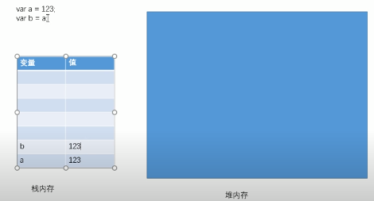
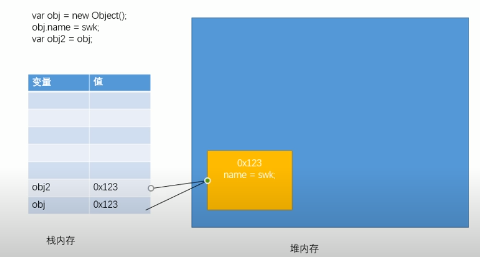
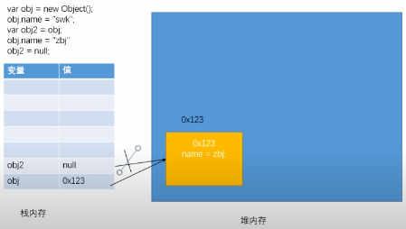

### 49. 基本数据类型和引用数据类型
1. JS中的变量都是保存到栈内存中的，基本数据类型的值直接在栈内存中存储，修改一个变量不会影响其他变量

2. 对象是保存到堆内存中的，每创建一个新的对象，就会在堆内存中开辟出一个新的空间。而变量保存的是对象的内存地址（对象的引用），如果两个变量保存的是一个对象引用时，一个变量进行改变，另一个也会发生改变

但当一个变量设置为null时，另一个变量并不受影响

3. 当比较两个基本数据类型的值时，就是比较值。而比较两个变量的时候，比较的是**对象的内存地址**