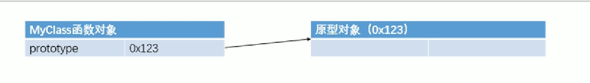
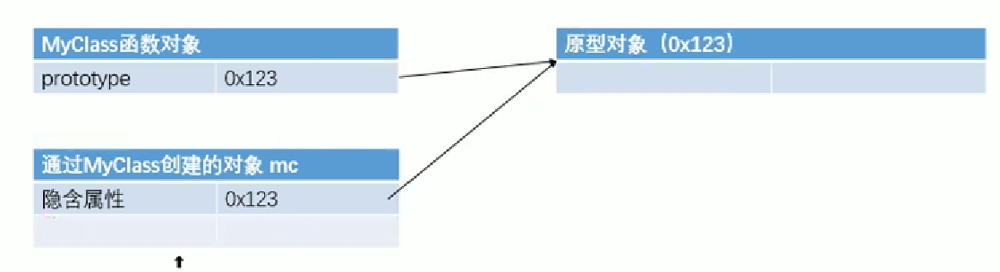
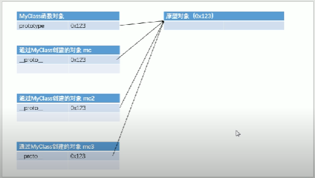
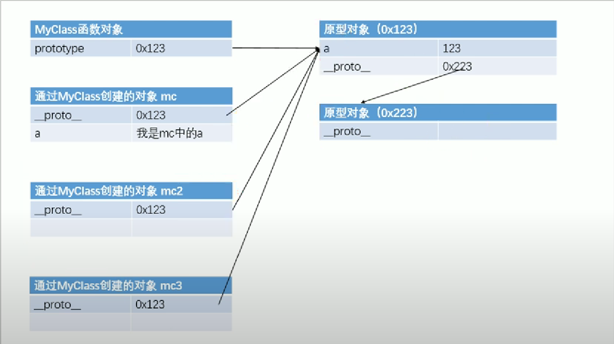

### 66&67. 原型对象
1. 将函数定义在全局作用域，污染了全局作用域的命名空间，而且定义在全局作用域很不安全

2. **原型**`prototype`：创建的每一个函数，解析器都会向函数中添加一个属性`prototype`，这个属性对应着一个对象，这个对象就是**原型对象**


3. 如果函数作为普通函数调用，prototype没有任何作用。当函数以**构造函数**形式调用时，所创建的对象中，都会有一个隐含的属性（`__proto__`）指向该构造函数的原型对象。

    我们可以通过`__proto__`来访问该属性


4. 原型对象就相当于一个公共的区域，所有同一个类的实例都可以访问到原型对象，我们可以将对象中共有的内容，统一设置到原型对象中
```js
// 向MyClass的原型中添加属性a
MyClass.prototype.a = 123;
// 向MyClass中添加方法
MyClass.prototype.sayHello() {
    console.log("hello");
};
```

5. 当我们访问对象的一个属性或方法时，它会先在对象自身中寻找，如果有则直接使用；如果没有，会去原型对象中寻找
6. 以后创建构造函数时，可以**将对象共有的属性或方法统一添加到构造函数的原型对象中**，这样不同分别为每一个对象添加，也不会影响到全局作用域
7. 使用in检查对象中是否含有某个属性时，如果对象中没有但是原型中有，也会返回true。可以使用`hasOwnProperty()`来检查对象自身中是否含有
```js
console.log(mc.hasOwnProperty("name"));
```

8. 原型对象也是对象，所以也有原型；当我们使用一个对象的属性时，会按照：**对象自身 - 原型对象 - 原型的原型** 的顺序寻找，直到找到Object对象的原型，Object对象的原型没有原型，如果仍然没有找到，则返回Undefined
