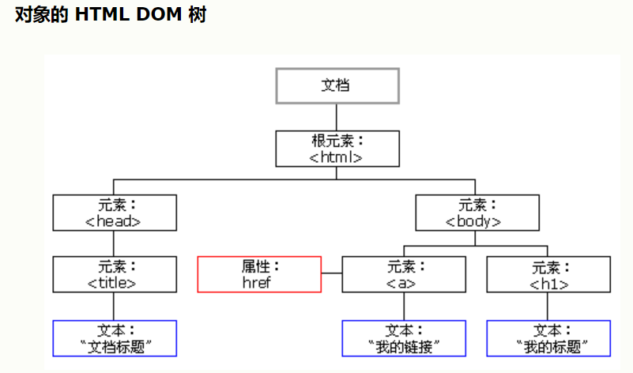

### 91. DOM简介

1. 什么是**DOM**
    DOM，全称 **Document Object Model**，文档对象模型
    - 文档：文档表示的就是整个的HTML网页文档
    - 对象：对象表示将网页中的每一个部分都转换为了一个对象
    - 模型：使用模型来表示对象之间的关系，这样方便获取对象
    

2. **节点（Node）**
    节点Node，是构成网页的最基本的组成部分，网页中的每一个部分都可以称为一个节点，比如：html标签、属性、文本、注释、整个文档都是一个节点。但是他们的具体类型是不同的：
    - **文档节点**：整个HTML文档
    - **元素节点**：HTML文档中的HTML标签
    - **属性节点**：元素的属性
    - **文本节点**：HTML标签中的文本内容

3. 浏览器已经为我们提供**文档节点**对象，这个对象是window属性，可以在页面中直接使用，文档节点代表的是整个网页