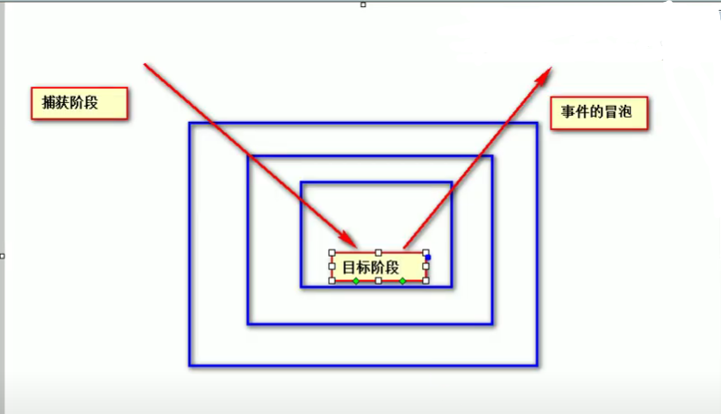

### 117. 事件的传播
1. **事件的传播**：关于事件的传播，网景公司和微软公司有不同的理解
    - 微软公司认为事件应该是由内向外传播，当事件触发时，应该先触发当前元素的事件，再触发祖先元素上的事件，因此事件是在冒泡阶段执行
    - 网景公司认为事件是由外向内传播的，当事件触发时，应该先触发元素最外层的祖先元素的事件，然后再向内传播给后代元素，因此事件是在捕获阶段执行
    - W3C综合了两个公司的方案，将事件的传播分成了三个阶段
        1. 捕获阶段
            在捕获阶段时，从最外层的祖先元素，向目标元素进行事件的捕获，但是默认此时不会触发事件
        2. 目标阶段
            事件捕获到目标元素，捕获结束开始在目标元素上触发事件
        3. 冒泡阶段
            事件从目标元素向他的祖先元素传递，依次触发祖先元素上的事件
        如果希望在捕获阶段就触发事件，可以将`addEventListener()`的第三个参数设置为`true`，一般情况下我们不希望在捕获阶段触发事件，所以一般都是false（IE8及以下浏览器没有捕获阶段）
    