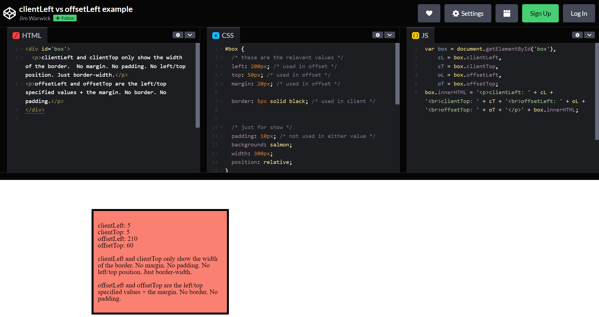

### 123. 键盘移动div
> 在练习中，使用键盘移动div时，需要获取div的初始位置，我使用了`clientLeft`，而参考使用了`offsetLeft`
>从图中可以看到，offsetLeft比clientLeft包含的内容明显更多，两者的区别如下：
> - clientLeft and clientTop only show the width of the border. No margin. No padding. No left/top position. Just border-width.
> - offsetLeft and offsetTop are the left/top specified values + the margin. No border. No padding.
> 可以[参考文章](https://codepen.io/scrimothy/pen/DOGLVO)

> 如果使用clientLeft的话，这个属性在一开始就是确定的，因此如果每次改变后不更新此属性，只能使用键盘移动div一次。但是如果使用offsetLeft属性，每次移动后此属性也会发生变化，所以不需要手动更新

---
## 更多参考
- `clientLeft` [参考文章](https://www.runoob.com/jsref/prop-element-clientleft.html)

`clientLeft` 表示一个元素的左边框的宽度，以像素表示。如果元素的文本方向是从右向左（RTL, right-to-left），并且由于内容溢出导致左边出现了一个垂直滚动条，则该属性包括滚动条的宽度。

`clientLeft` 不包括左外边距和左内边距。

**clientLeft 是只读的**

- `offsetLeft` [参考文章](https://www.runoob.com/jsref/prop-element-offsetleft.html)

`offsetLeft` 是一个**只读属性**，返回当前元素相对于 offsetParent 节点左边界的偏移像素值。

返回值包含:

元素向左偏移的像素值，元素的外边距（margin）
offsetParent 元素的左侧内边距（padding）、边框（border）及滚动条

注意: offsetParent 元素是一个指向最近的（指包含层级上的最近）包含该元素的定位元素或者最近的元素

