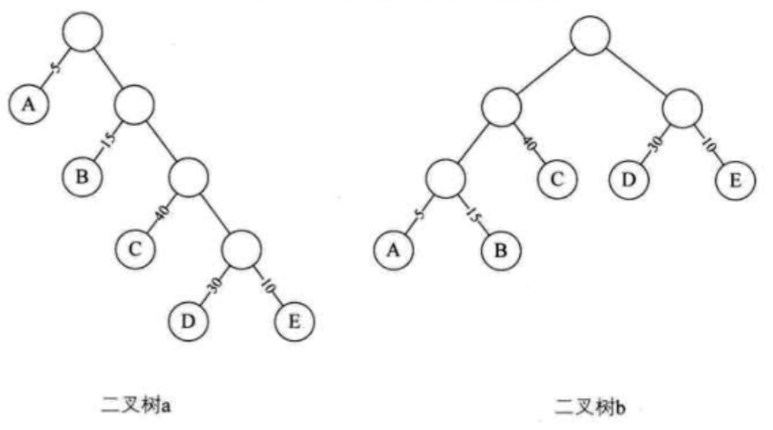

## 赫夫曼树定义及原理

1. 从树中一个结点到另一个结点之间的分支构成两个结点之间的路径，路径上的分支数目称作**路径长度**

2. **树的路径长度**就是从树根到每一结点的路径长度之和

3. **带权路径长度WPL最小的二叉树**称做赫夫曼树
    如二叉树a：`WPL = 5*1 + 15*2 + 40*3 + 30*4 + 10 *4 = 315`
    二叉树b: `WPL = 5*3 + 15*3 + 40*2 + 30*2 + 10*2 = 220`