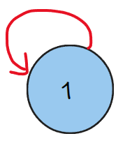
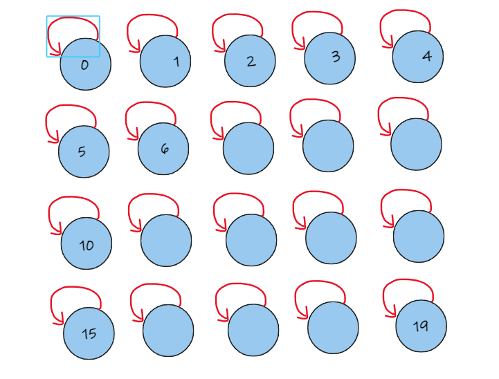
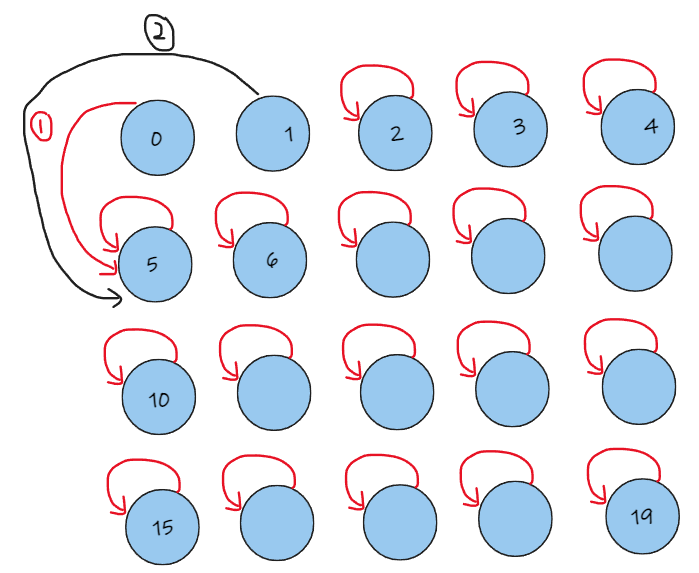

## 200. 岛屿数量

### [题目](https://leetcode.cn/problems/number-of-islands)
给你一个由 '1'（陆地）和 '0'（水）组成的的二维网格，请你计算网格中岛屿的数量。岛屿总是被水包围，并且每座岛屿只能由水平方向和/或竖直方向上相邻的陆地连接形成。此外，你可以假设该网格的四条边均被水包围。

### 解答

#### 1. 相关知识点
***广度优先搜索***, ***深度优先搜索***, ***并查集***

#### 2. 我的题解

##### 2.1 深度优先搜索

深度优先搜索的方法，是从第一个为1的节点开始，以这个节点作为根节点，向着“上、下、左、右”四个方向分别进行搜索。将遇到的陆地都标记起来（本题中是将陆地变为海洋，即1变为0，但是题解中有人提到，如果有其他情况需要标记何处是陆地，改为0之后就分不出来了，所以在这里将1改为2）。在一个节点深度优先搜索完成后，去搜索下一个为1的节点，这样，进行搜索的次数，就是岛屿的数量。
```js
/**
 * @param {character[][]} grid
 * @return {number}
 */
var numIslands = function (grid) {
    // 记录最终结果
    var res = 0;
    // 如果grid为空，则直接返回
    if (grid == null) return res;

    // 获取grid的宽和高
    const m = grid.length;
    const n = grid[0].length;

    for (var i = 0; i < m; i++) {
        for (var j = 0; j < n; j++) {
            if (grid[i][j] == 1) {
                dfs(grid, i, j);
                res++;
            }
        }
    }

    return res;
};

var dfs = function (grid, posi, posj) {
    if (!isInGird(grid, posi, posj)) return;
    if (grid[posi][posj] != 1) return;
    grid[posi][posj] = 2;
    dfs(grid, posi - 1, posj);
    dfs(grid, posi + 1, posj);
    dfs(grid, posi, posj - 1);
    dfs(grid, posi, posj + 1);
};

var isInGird = function (grid, posi, posj) {
    if (0 <= posi && posi < grid.length && 0 <= posj && posj < grid[0].length) {
        return true;
    } else {
        return false;
    }
};

```

##### 2.2 广度优先搜索
广度优先搜索的思路其实和深度优先搜索差不多，都是从一个节点出发，将遇到的陆地节点标记起来。只不过在搜索时，是将为1的节点加入队列，搜索它周围的四个节点（并取出这个节点），如果有1的，也加入队列，并进行标记，直到队列为空。同样，搜索的次数就是陆地的数量

```js
/**
 * @param {character[][]} grid
 * @return {number}
 */
var numIslands = function (grid) {
    const nr = grid.length;
    const nc = grid[0].length;
    let res = 0;

    // 如果grid为空则直接返回
    if (nr == 0) return res;

    // 创建一个队列，记录当前为1的位置
    let zeroList = [];

    for (var r = 0; r < nr; r++) {
        for (var c = 0; c < nc; c++) {
            if (grid[r][c] == 1) {
                // 将r, c加入队列，记录位置
                zeroList.push([r, c]);
                res++;
                grid[r][c] = 2;
                while (zeroList.length > 0) {
                    // 获取存储的位置
                    let pos = zeroList.shift();
                    let posr = pos[0];
                    let posc = pos[1];
                    for (const node of [[posr - 1, posc], [posr + 1, posc], [posr, posc - 1], [posr, posc + 1]]) {
                        // 检查坐标合法性
                        if (node[0] < 0 || node[0] >= nr || node[1] < 0 || node[1] >= nc || grid[node[0]][node[1]] != 1) {
                            continue
                        }
                        grid[node[0]][node[1]] = 2;
                        zeroList.push([node[0], node[1]])
                    }
                }
            }
        }
    }

    return res;
};
```

##### 2.3 并查集
本题并查集的做法，就是如果遇到为1的节点，就去判断它下边和右边的节点是否为1（因为是从左上角的节点开始遍历，再去检索左和上没有意义），如果是1的话，就把他们合并到同一个分支。并查集的三个关键步骤就是：
1. 初始化 `init`
    将每个节点都初始化为一个独立的分支，此时这个节点的根节点就是它自己
    
2. 查找 `find`
    查找每个节点的根节点，在这个过程中，通过 `this.parent[x] = this.parent[this.parent[x]]` 来进行路径压缩，方便之后的查找
3. 合并 `union`
    首先查找两个节点的根节点，如果根节点不同，则进行合并（一般都是节点个数少的合并进节点个数多的分支）
    
在本题中，首先进行初始化，由于是二维数组，其实是将他们按次序编了号(以一个5*4的数组为例)
    

之后开始从左上角的节点开始遍历，比如第一次，是0和5进行合并，他们的根节点也分别是0和5，且二者所在分支的节点数量都是一致的（只经过了初始化，都是1），这样，两者在`union`的时候，0的根节点就会变为5。之后在第二次合并时，是0和1合并，此时0的根节点是5，所在的分支节点数量大于1所在的分支节点数量（此时1的分支也只有它自己），因此，1要并入0和5的分支
    

以此类推进行合并。
在计算岛屿数量方面，在初始时，其实我们是假定了有5*4个岛屿，每次合并时，就会少一块岛屿（2合1），此外，如果遇到标记为`0`的海洋，则自然岛屿数量也减一，因此最后直接返回`count`即可

```js
/**
 * @param {character[][]} grid
 * @return {number}
 */

 class UnionFind{
    constructor(n){
        // 初始化一个
        this.count = n;
        // 初始化一个队列，用来存储各个节点的祖先
        this.parent = new Array(n);
        // 记录该分支里面的节点数量
        this.size = new Array(n);
        // 初始化节点的祖先为自己
        for (var i = 0; i < n; i++) {
            this.parent[i] = i;
            this.size[i] = 1;
        }
    }

    // 合并路径
    union(node1, node2) {
        // 分别找到node1和node2的祖先
        let root1 = this.find(node1);
        let root2 = this.find(node2);
        // 如果两个点的祖先一样，跳过此次合并
        if (root1 === root2) return;
        // 如果node1分支上的节点数量大于node2，则将node2分支合并到node1，否则就将node1合并到node2
        if (this.size[root1] > this.size[root2]) {
            this.parent[root2] = root1;
            this.size[node1] += this.size[node2];
        } else {
            this.parent[root1] = root2;
            this.size[node2] += this.size[node1];
        }
        // 合并完之后，并查集的数量要减少1
        this.count--;
    }

    // 查找祖先节点，并进行路径压缩
    find(x) {
        while (this.parent[x] != x) {
            // 进行路径压缩
            this.parent[x] = this.parent[this.parent[x]];
            x = this.parent[x];
        }
        return x;
    };
}

var numIslands = function(grid) {
    // 如果grid为空则直接返回
    if (grid.length == 0) return 0;
    const r = grid.length;
    const c = grid[0].length;
    let uf = new UnionFind(r * c);
    for (var i = 0; i < r ; i++) {
        for (var j = 0; j < c; j++) {
            // 如果节点为0，则和zeroNode合并
            if (grid[i][j] == 0) {
                uf.count--;
            } else {
                // 此节点为1，则要向下和向右判断是否为1，是，则合并
                for (const [nr, nc] of [[i + 1, j], [i, j + 1]]) {
                    // 判断坐标的合法性,是否为1
                    if (nr < r && nc < c && grid[nr][nc] == 1) {
                        uf.union((i * c + j), (nr * c + nc));
                    }
                }
            }
        }
    }

    return uf.count;
};
```

#### 3. 参考解法
