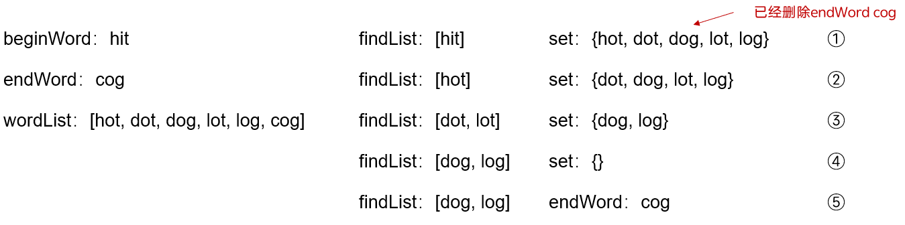

## 127. 单词接龙

### 题目
字典 `wordList` 中从单词 `beginWord` 和 `endWord` 的 转换序列 是一个按下述规格形成的序列 `beginWord -> s1 -> s2 -> ... -> sk`：
- 每一对相邻的单词只差一个字母。
- 对于 `1 <= i <= k` 时，每个 `si` 都在 `wordList` 中。注意， `beginWord` 不需要在 `wordList` 中。
- sk == endWord
给你两个单词 `beginWord` 和 `endWord` 和一个字典 `wordList` ，返回 从 `beginWord` 到 `endWord` 的 **最短转换序列** 中的 单词数目 。如果不存在这样的转换序列，返回 0 。

### 解答

#### 1. 相关知识点
***广度优先搜索***

#### 2. 我的题解

##### 2.1 广度优先搜索
1. 从`wordList`中创建一个集合，在这个集合中判断是否有`endWord`，如果没有，则直接返回0，如果有，则继续执行
2. 创建一个检索列表，先将`beginWord`入列，之后依次判断集合中的单词是否符合要求，如果符合，则将单词入列，并从集合中删去
    - 注意1：如果没有检索到符合条件的单词，返回结果0
    - 注意2：如果beginWord和endWord之间符合要求，则直接返回2
3. 将检索列表中检索过的单词删去


```js
/**
 * @param {string} beginWord
 * @param {string} endWord
 * @param {string[]} wordList
 * @return {number}
 */
var ladderLength = function (beginWord, endWord, wordList) {

    // 获取单词的长度，本题中len是常量
    const len = beginWord.length;

    // 判断两个单词是否只相差一个字母
    var getDiff = function (a, b) {
        let flag = 0;
        for (var i = 0; i < len; i++) {
            if (a.charAt(i) != b.charAt(i)) flag++;
            if (flag > 1) return false;
        }
        return true;
    };

    /*
    * @param{array} findlist: 需要查找的单词列表
    * @param{set} wordSet: 目前有的单词集合
    * @param{number} res: 结果
    * @return{number} res
     */
    var findWay = function (findList, wordSet, endWord, result) {
        while (wordSet.size != 0) {
            result++;
            let findTimes = findList.length;
            if (findTimes == 0) return 0;
            for (var i = 0; i < findTimes; i++) {
                for (var checkWord of wordSet.keys()) {
                    if (getDiff(findList[i], endWord)) {
                        result++;
                        return result;
                    }
                    if (getDiff(checkWord, findList[i])) {
                        findList.push(checkWord);
                        wordSet.delete(checkWord);
                    }
                }
            }
            findList.splice(0, findTimes);
        }

        for (var i = 0; i < findList.length; i++) {
            if (getDiff(endWord, findList[i])) {
                result += 2;
                return result;
            }
        }

        return 0;
    };

    // 根据单词列表创建集合
    const wordSet = new Set(wordList);
    let res = 0;
    // 如果endWord不在wordList中，直接返回0，否则将直接删除
    if (wordSet.delete(endWord) === false) return res;
    // 如果beginWord和endWord直接符合条件，则返回2
    if (getDiff(beginWord, endWord)) return 2;
    res = findWay([beginWord], wordSet, endWord, res);

    return res;
};
```

##### 2.2 广度优先搜索+优化建图
与普通的广度优先搜索差不多，但是在普通的BFS中，需要专门维护一个值记录当前的层数，而在优化的BFS中，直接记录单词和他的层数
另外，在下面这个地方，可以直接使用`[word, level]` 去声明变量，这样方便之后使用
```js
let checkWord = findList.shift(); // 这样的话，checkWord是一个array，之后使用的时候还要用 checkWord[0], chenckWord[1].. 不是很方便
let [checkWord, level] = findList.shift(); // 这样后面就可以直接用 checkWord 和 level 了
```

```js
/**
 * @param {string} beginWord
 * @param {string} endWord
 * @param {string[]} wordList
 * @return {number}
 */
var ladderLength = function(beginWord, endWord, wordList) {

    // 获取单词的长度，本题中len是常量
    const len = beginWord.length;
    // 根据wordList创建结合set
    const wordSet = new Set(wordList);

    // 判断两个单词是否只相差一个字母
    var getDiff = function (a, b) {
        let flag = 0;
        for (var i = 0; i < len; i++) {
            if (a.charAt(i) != b.charAt(i)) flag++;
            if (flag > 1) return false;
        }
        return true;
    };

    // 如果wordList为0或者不含有endWord，直接返回0
    if (wordList.length == 0 || !wordSet.has(endWord)) return 0;
    // 如果beginWord和endWord符合条件，直接返回2
    if (getDiff(beginWord, endWord)) return 2;

    // 创建检索数组，并将beginWord入列，并将层数加入
    const findList = [[beginWord, 1]];
    while (findList.length != 0) {
        let checkWord = findList.shift();
        if (checkWord[0] == endWord) return checkWord[1];
        for (var word of wordSet) {
            // 如果符合条件，则加入检索数组。并将层数加1
            if (getDiff(checkWord[0], word)) {
                findList.push([word, (checkWord[1] + 1)]);
                wordSet.delete(word);
            }
        }
    }

    return 0;
};
```