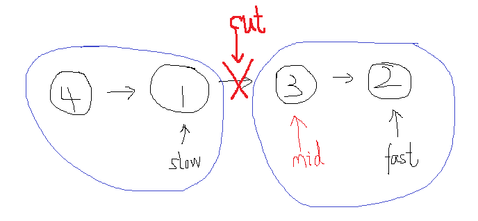
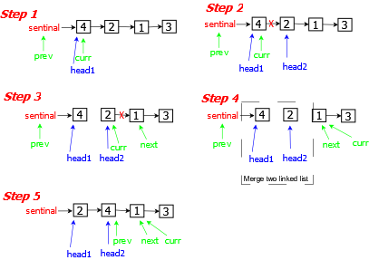

## 148. 链表排序

### 题目描述

给你链表的头结点 `head` ，请将其按 **升序** 排列并返回 **排序后的链表** 。

### 解答

#### 1. 相关知识点

`归并排序（自顶向下和自底向上）`, `找到链表中点（快慢指针法）`, `合并有序链表`

#### 2. 解答

##### 2.1 递归归并（自顶向下）

使用递归的方法，将链表不断地从中点拆分成两个链表，然后再将两个链表合并为升序列表。其中，递归结束的判断条件是：链表中没有节点或只有一个节点

- 注1：此处为递归结束的判断条件。同时，在这里已经判断了`head`和`head.next`均不为`null`，因此下方可以直接新建 `slow = head; fast = head.next`

- 注2：刚开始这个方法一直提示栈溢出，其实就是因为这里没有写对，在将一个链接拆分为两个时，要注意虽然我们设定的`slow`指针，此时是指向了中间节点，将链表划分为了 `head -- slow` 和 `slow.next -- tail` 两个部分，但其实此时 `slow` 的 `next` 指针仍存在，即没有切分数组，因此会一直进行切分。正确的方法是在这里，先新建一个 `mid` 指针记录 `slow.next`，然后将 `slow.next`设置为`null`，这样就可以把链接切分了



```javascript
/**
 * Definition for singly-linked list.
 * function ListNode(val, next) {
 *     this.val = (val===undefined ? 0 : val)
 *     this.next = (next===undefined ? null : next)
 * }
 */
/**
 * @param {ListNode} head
 * @return {ListNode}
 */
var sortList = function(head) {
    return mergeSort(head);
};

const mergeSort = (head) => {
    // 设置递归结束条件：子序列为空，或子序列长度为1
    if (head == null || head.next == null) return head; // {注1}
    let slow = head; // 慢指针，一次走一步
    let fast = head.next; // 快指针，一次走两步
    while (fast && fast.next) {
        slow = slow.next;
        fast = fast.next.next;
    }
    let mid = slow.next; //{注2} 
    slow.next = null;
    let left = mergeSort(head);
    let right = mergeSort(mid);
    return mergeLinkedList(left, right);
};

const mergeLinkedList = (list1, list2) => {
    let sentinal = new ListNode(0);
    let temp = sentinal;
    let p1 = list1;
    let p2 = list2;
    while (p1 != null && p2 != null) {
        if (p1.val < p2.val) {
            temp.next = p1;
            p1 = p1.next;
        } else {
            temp.next = p2;
            p2 = p2.next;
        }
        temp = temp.next;
    }
    if (p1 !== null) temp.next = p1;
    if (p2 !== null) temp.next = p2;
    return sentinal.next;
};
```

##### 非递归归并（自底向上)

采用非递归的形式进行链表的归并排序，其实和数组是差不多的，难点在于如何获得每次需要归并的两个链表

在这里我们需要新建很多的指针，以获得链表。如下图所示，以第一次归并为例

1. 首先设置`prev`和`curr`两个节点，前者指向`sentinal`，后者指向`head`，同时创建`head1`用于标记第一个链表的起始位置

2. 之后按照需要向后移动的次数`step`，将`curr`指针向后移动，注意，其实在创建时，`curr`已经在`prev`后面一个了，所以for循环开始，i直接为1。移动后，再次创建新的指针`head2 = curr.next`，同时设置`curr.next = null`以断开链表

3. 设置`curr = head2`继续开始往后走`step - 1`步（因为刚才设置时已经相当于向后移了一步）。之后创建`next`指针用于标识下一次合并开始的位置。最后设置`curr.next = null`以断开`head2`链表

4. 合并两个有序链表`head1`和`head2`，并设置`prev.next = merge(head1, head2)`，以使排序好的链表连接起来

5. 连接好链表后，将`prev`链表向后移动至当前链表的末尾，等待下一个排序好的链表



```javascript
var sortList = function(head) {
    // 如果是空或者单节点，直接返回
    if (head == null || head.next == null) return head;

    // 获取链表的长度
    let getLen = head;
    let length = 1;
    while (getLen.next != null) {
        length++;
        getLen = getLen.next;
    }

    let sentinal = new ListNode(0, head);
    for (let step = 1; step < length; step <<= 1) {
        let prev = sentinal;
        let curr = sentinal.next; 
        while (curr != null) {
            let head1 = curr; // 标记head1起始位置
            for (let i = 1; i < step && curr.next != null; i++) {
                curr = curr.next;
            }
            let head2 = curr.next;
            curr.next = null;
            curr = head2;
            for (let j = 1; j < step && curr != null && curr.next != null; j++) {
                curr = curr.next;
            }
            let next = null;
            if (curr != null) {
                next = curr.next;
                curr.next = null;
            }
            prev.next = merge(head1, head2);
            while (prev.next != null) {
                prev = prev.next;
            }
            curr = next;
        }
    }

    return sentinal.next;
};

const merge = (list1, list2) => {
    let sentinal = new ListNode(0);
    let temp = sentinal;
    let head1 = list1;
    let head2 = list2;
    while (head1 !== null && head2 !== null) {
        if (head1.val < head2.val) {
            temp.next = head1;
            head1 = head1.next;
        }else {
            temp.next = head2;
            head2 = head2.next;
        }
        temp = temp.next;
    }
    if (head1 == null) {
        temp.next = head2;
    }
    if (head2 == null) {
        temp.next = head1;
    }
    return sentinal.next;
};
```
