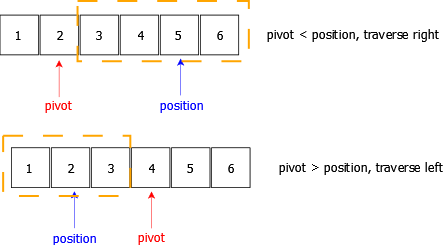

## 215. Kth Largest Element in an Array

### 题目描述

Given an integer array `nums` and an integer `k`, return the $k^{th}$ largest element in the array.

Note that it is the $k^{th}$ largest element in the sorted order, not the kth distinct element.

You must solve it in $O(n)$ time complexity.

### 解答

#### 1. 相关知识点

`快速选择`, `堆排序`

#### 2. 解答

##### 2.1 快速选择

快速选择是从快速排序延伸过来的一种方法，思想都是类似地

快速排序是在一次排序中，选择一个枢轴（pivot），通过比较和交换，将枢轴左右两侧分别放上比它大的或比它小的

快速选择可以利用这一点，同样选择一个枢轴`pivot`，将比它大和小的分别放在两侧，加入此时枢轴的索引`index`正好满足题目要求的位置，则这个数就是我们要找的，直接返回即可，无需再进行之后的比较。同时，我们每次只需要根据`pivot`与需要返回的位置，选取一侧继续递归即可


在主要方法`partition()`中，按照如下步骤进行：

1. 首先随机选择一个位置作为`pivot`，因为无论是取左，取右或者其他不变的参数，都意味着总会有一个特殊情况与之对应，所以应该是用随机数函数进行取值

2. 取到这个`pivot`的值后，将`nums[pivot]`和`nums[left]`进行对调，将这个值交换到最左侧，暂时不参与后续的比较

3. 新建一个变量`little`，代表比`nums[pivot]`小的数的位置，初始位置为`left+1`

4. 从左向右，即从`left+1 ~ right`遍历数组，遇到比`nums[pivot]`小的值，就将他们移到左侧。注意，由于`little++`，此时`little`指向的数字其实比`nums[pivot]`要大，因此要将`little-1`和`left`进行交换（不用考虑顺序，只要左侧值都比`nums[pivot]`小即可 *[1]*）

5. 经过变换，此时`little-1`即为`nums[pivot]`的值，如果`little-1`就是我们要找的位置，那么直接返回即可

```javascript
/**
 * @param {number[]} nums
 * @param {number} k
 * @return {number}
 */
var findKthLargest = function (nums, k) {
    return quickSelect(nums, 0, nums.length - 1, nums.length - k);
};

function quickSelect(nums, left, right, index) {
    let pivot = partition(nums, left, right);
    if (pivot == index) {
        return nums[pivot];
    } else if (pivot < index) {
        // pivot < index，证明需要的值在右侧区间
        return quickSelect(nums, pivot + 1, right, index);
    } else {
        // pivot > index，证明需要的值在左侧区间
        return quickSelect(nums, left, pivot - 1, index);
    }
}

function partition(nums, left, right) {
    let middle = Math.floor(Math.random() * (right - left) + left); // {1}
    let midNum = nums[middle];
    // 将随机取的中间的值交换到最左侧
    swap(nums, left, middle);
    let little = left + 1;
    for (let i = little; i <= right; i++) {
        if (nums[i] < midNum) {
            swap(nums, i, little);
            little++;
        }
    }
    swap(nums, little - 1, left); // [1]
    return little - 1;
}

swap = (nums, a, b) => {
    let temp = nums[a];
    nums[a] = nums[b];
    nums[b] = temp;
}
```

- 注1：`JavaScript`生成随机数可以参照 [js 生成随机数 | 菜鸟教程](https://www.runoob.com/w3cnote/js-random.html)

##### 2.2 堆排序

可以把整个数组构建成一个大顶堆，并且每次将根节点（最大值）移出，这样第`k`次，就是需要的结果了

有关堆排序的模板可以参考[堆排序 1.5](../sort.md) 

```javascript
var findKthLargest = function (nums, k) {
    let heapSize = nums.length;
    buildMaxHeap(nums, heapSize);
    for (let i = nums.length - 1; i >= nums.length - k + 1; i--) {
        swap(nums, i, 0);
        heapSize--;
        maxheapify(nums, 0, heapSize);
    }
    return nums[0];
};

function buildMaxHeap(nums, heapSize) {
    for (let i = Math.floor((heapSize - 2) / 2); i >= 0; i--) {
        maxheapify(nums, i, heapSize);
    }
}

function maxheapify(nums, i, heapSize) {
    let leftChild = 2 * i + 1;
    let rightChild = 2 * i + 2;
    let max = i;
    if (leftChild < heapSize && nums[max] < nums[leftChild]) {
        max = leftChild;
    }
    if (rightChild < heapSize && nums[max] < nums[rightChild]) {
        max = rightChild;
    }
    if (max != i) {
        swap(nums, i, max);
        // 递归交换后面的节点
        maxheapify(nums, max, heapSize);
    }
}

swap = (nums, a, b) => {
    let temp = nums[a];
    nums[a] = nums[b];
    nums[b] = temp;
}
```
