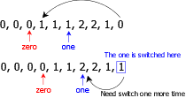

## 75. Sort Colors

### 题目描述

Given an array `nums` with `n` objects colored red, white, or blue, sort them **in-place** so that objects of the same color are adjacent, with the colors in the order red, white, and blue.

We will use the integers 0, 1, and 2 to represent the color red, white, and blue, respectively.

You must solve this problem without using the library's sort function.

### 解答

#### 1. 相关知识点

`双指针`

#### 2. 解答

##### 2.1 单指针

使用单指针，遍历两次，使用一个指针记录头部位置

在第一次遍历时，遇到`0`，就把他交换到头部，同时将头部指针的位置`+1`

在第二次遍历时，遇到`1`，就把他交换到头部，同时将头部指针的位置`+1`

```javascript
/**
 * @param {number[]} nums
 * @return {void} Do not return anything, modify nums in-place instead.
 */
var sortColors = function (nums) {
    let head = 0; // 记录头部位置，第一次循环时记录0的个数，第二次记录1的个数
    // 确定0的个数
    for (let i = 0; i < nums.length; i++) {
        if (nums[i] === 0) {
            swap(nums, i, head);
            head++;
        }
    }
    // 确定1的个数
    for (let j = head; j < nums.length; j++) {
        if (nums[j] === 1) {
            swap(nums, j, head);
            head++;
        }
    }

    function swap(array, a, b) {
        let temp = array[a];
        array[a] = array[b];
        array[b] = temp;
    }
};
```

##### 2.2 双指针 一（记录0和1）

**2.1**的方法虽然可以，但是不满足题目要求的遍历一次

我们可以使用两个指针`zero, one`来记录`0`和`1`的位置，从左向右遍历数组

- 如果遇到了`1`，那么交换`nums[i]`和`nums[one]`即可

- 如果遇到了`0`，那么需要分成两种情况讨论
  
  - 如果连续的`0`后面没有连续的`1`，那么我们只需要将`zero`和`one`指针同时`+1`即可
  
  - 如果连续的`0`后面有连续的`1`，那么我们在交换时，肯定会将连续`0`后面的那个`1`交换出去，这就会造成错误，因此需要再把它交换回来
    

```javascript
var sortColors = function (nums) {
    let zero = 0; 
    let one = 0;
    for (let i = 0; i < nums.length; i++) {
        // 如果nums[i]是0，那么交换nums[i]和nums[zero]，同时让zero指针和one指针同时 +1
        if (nums[i] === 0) {
            swap(nums, i, zero);
            if (zero < one) {
                swap(nums, i, one);
            }
            zero++;
            one++;
        } else if (nums[i] === 1) {
            swap(nums, i, one);
            one++
        }
    }

    function swap(array, a, b) {
        let temp = array[a];
        array[a] = array[b];
        array[b] = temp;
    }
};
```

##### 2.3 双指针 二 （交换0和2）

与**2.2**类似，只不过这次可以寻找`0`和`2`，需要注意的是，如果`0`指针和`2`指针已经相遇，那么代表整个数组已经遍历完整，不需要继续遍历了

- 找`0`的步骤与前面类似，依旧是从左向右即可

- 找`2`则需要从右向左，特别需要注意的是，在交换了`nums[two]` 和`nums[i]`后，可能交换到`nums[i]`位置的依旧是`2`，因此需要继续交换
  
  - 另外还要注意的是，在交换了`nums[two]`和`nums[i]`后，可能`nums[i]`的值为`0`，因为此次遍历后，`i`的值会`+1`，所以，还需要把这个`0`交换到前面。在代码中，只需要注意判断`2`和判断`0`的顺序即可

```javascript
var sortColors = function (nums) {
    let zero = 0;
    let two = nums.length - 1;
    for (let i = 0; i <= two; i++) {
        // 判断2的一定要在前面
        while (nums[i] === 2 && i <= two) {
            swap(nums, i, two);
            two--;
        }
        if (nums[i] === 0) {
            swap(nums, i, zero);
            zero++;
        }

        function swap(array, a, b) {
            let temp = array[a];
            array[a] = array[b];
            array[b] = temp;
        }
    }
};
```
