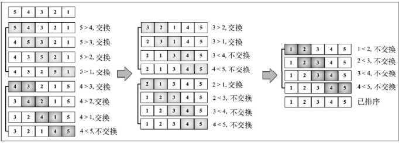
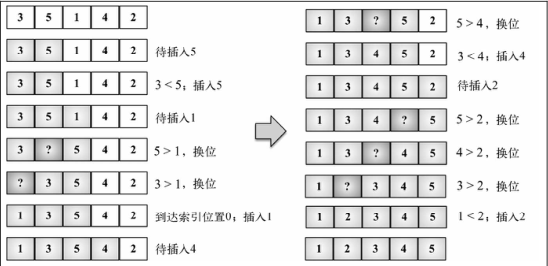
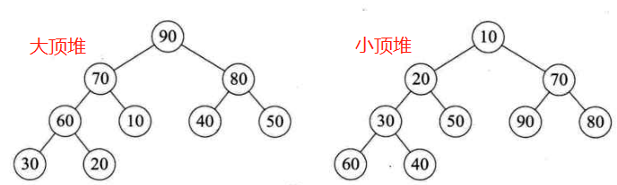
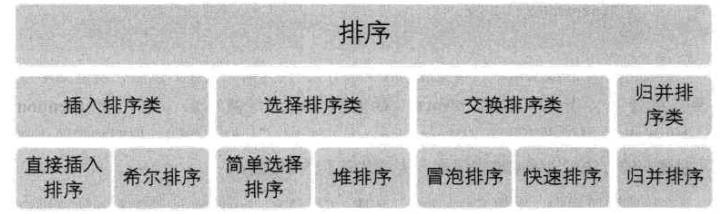

# Basic Knowledge -- Sort

## 1. 排序的基本概念与分类

- **稳定性**：假设 $K_i=K_j (1\le i \le n,1\le j\le n)$ ，且在排序前的序列中 $r_i$ 领先于 $r_j$ （即 $i<j$)。如果排序后 $r_i$ 仍领先于 $r_j$ ，则称所用的排序方法是稳定的；反之，则是不稳定的

### 1.1 内排序与外排序

- **内排序**是在排序整个过程中，待排序的所有记录全部被放置在内存中
- **外排序**是由于排序的记录个数太多，不能同时放置在内存，整个排序过程需要在内外存之间多次交换数据才能进行
- 根据排序过程中借助的主要操作，**内排序分为**：插入排序、交换排序、选择排序和归并排序

### 1.2 冒泡排序

- **冒泡排序（Bubble Sort）** 是一种交换排序，它的基本思想是：**两两比较相邻记录的关键字，如果反序则交换，直到没有反序的记录为止**，元素向上移动至正确的顺序，就像气泡升至表面一样，因此称为冒泡排序



经典的冒泡排序如上图所示，但是我们可以看到，其实在第一次循环之后，5已经移动到了最后，之后的循环中没有必要对其进行比较，因此，可以进行优化：第一轮循环后，其实最大的一位已经到了最后，再下一次内循环中，可以减少一次；以此类推，内循环中可以减去外循环的次数


<u>代码如下</u>：

```js
function modifiedBubbleSort(array) {
    const length = array.length;
    for (let i = 0; i < length; i++) {
        for (let j = 0; j < length -1 - i; j++) {
            if (array[j] > array[j+1]) {
                swap(array, j, j + 1); //swap参照文末方法
            }
        }
    }
}
```

> 冒泡排序复杂度分析
> 最好为：$O(n)$，最坏为：$O(n^2)$
- 最好的情况，就是排序的表本身就是有序的，因此只需要第一轮判断即可(n-1)次，即时间复杂度为 $O(n)$
- 最坏的情况，完全是逆序，那么就需要循环完全，第一次(n-1)，第二次(n-2)，第三次(n-3)···一直到1，如下式所示，因此总的时间复杂度为 $O(n^2)$
$1+2+3+···+(n-2)+(n-1) = \frac{n*(n-1)}{2}$

### 1.3 简单选择排序
- **简单选择排序法（Simple Selection Sort）** 就是通过 `n-i` 次关键字间的比较，从 `n-i+1` 个记录中选出关键字最小的记录，并和第 `i(1<=i<=n)` 个记录交换。即第i次找到第i小的值，并放在第i位

<u>代码如下</u>：

```js
function selectionSort(array) {
    const length = array.length;
    let indexMin; // 标记最小值的位置
    for (let i = 0; i < length; i++) {
        indexMin = i;
        for (let j = i + 1; j < length; j++) {
            if (array[j] < array[indexMin]>) { // 比较indexMin位置的值和j位置的值的大小
                indexMin = j;
            }
        }
        // 如果i位置的值不再是indexMin位置的值，则交换二者，注意这里虽然比较了多次，但是只交换一次
        if ( i !== indexMin) {
            swap(array, i, indexMin); 
        }
    }
}
```

> 简单选择排序复杂度分析
> $O(n^2)$
- 不管情况如何，都需要进行(n-i) 次比较，第一次(n-1)，第二次(n-2)，第三次(n-3)···一直到1，如下式所示，因此总的时间复杂度为 $O(n^2)$ 。但是要注意，虽然与冒泡排序复杂相同，但是简单选择排序由于交换次数少，性能还是要好于冒泡排序的
$1+2+3+···+(n-2)+(n-1) = \frac{n*(n-1)}{2}$

### 1.3 直接插入排序

- **直接插入排序（Straight Insertion Sort）** 的基本操作是将一个记录插入到已经排好序的有序表中，从而得到一个新的、记录数增1的有序表



<u>代码如下</u>：

```js
function insertionSort(array) {
    const length = array.length;
    let temp; // 创建一个哨兵节点
    for (let i = 1 ; i < length ; i++) { //注意这里i的索引是从1开始的，因为默认第一项已经排序了
        let j = i;
        temp = array[i];
        while (j > 0 && array[j-1] > temp) {
            array[j] = array[j-1];
            j--;
        }
        array[j] = temp;
    }
}
```

> 直接插入排序复杂度分析
> 最好 $O(n)$ ; 最坏 $O(n^2)$
> 对于小型数组，插入排序要比冒泡和选择排序性能好一些
- 最好的情况下就是数组本身就是有序的，那么只需要遍历一次i就行，即 $n-1$ 次，复杂度为 $O(n)$
- 最坏的情况下，数组完全逆序，就需要比较 $2+3+···+(n-1)+n = \frac{(n+2)(n-1)}{2}$ ，而记录移动次数达到最大值 $\sum_{i=2}^n (i+1)= \frac{(n+4)(n-1)}{2}$ ，如果排序记录是随机的，那么根据概率相同的原则，平均比较和移动次数约为 $\frac{n^2}{4}$


### 1.4 希尔排序
- **希尔排序（Shell Sort）** 是将相距某个“增量”的记录组成一个子序列，这样才能保证在子序列内分别进行直接插入排序后得到的结果是基本有序而不是局部有序

<u>代码如下</u>：

```js
// 本代码为参考模板自己编写
function shellSort(array) {
    let i;
    let j;
    let increment = array.length;
    let temp;
    do {
        increment = parseInt(increment / 3 + 1); // 增量序列
        for (i = increment; i < array.length; i++) {
            if (array[i] < array[i - increment]) {
                temp = array[i];
                for (j = i - increment; j >= 0 && temp < array[j]; j -= increment) {
                    array[j + increment] = array[j]; // 把大的数字往后移动
                }
                array[j + increment] = temp; // 上一步移动完后，j还要再减去一次increment，因此需要加上一个补回来
            }
        }
    } while (increment > 1);

    return array;
}
```

> 希尔排序复杂度分析
> 当增量序列合理时，时间复杂度为 $O(n^\frac{3}{2})$


### 1.5 堆排序

- **堆**是具有下列性质的**完全二叉树**：每个结点的值都大于或等于其左右孩子结点的值，称为**大顶堆**；每个结点的值都小于或等于其左右孩子结点的值，称为**小顶堆**


- **堆排序（Heap Sort）**就是利用堆进行排序的方法。以大顶堆为例，将待排序的序列构造成一个大顶堆，此时整个序列的最大值就是顶堆的根结点。将它移走后，将剩余的n-1个序列重新构造成一个堆，就会得到n个元素中次大值。反复执行，就能得到有序序列

<u>代码如下</u>：

```js
function HeapSort(array) {
    let length = array.length; // 获取堆(完全二叉树)的节点数量
    HeapAdjust(array, length); // 调整为一个大顶堆
    for (let i = (length - 1); i > 0; i--) {
        swap(array, i, 0);
        HeapAdjust(array, i); // 再次调整为大顶堆
    }
}

var HeapAdjust = function (array, length) {
    /*
     * 这里是利用了完全二叉树的性质，如果完全二叉树节点个数为n，那么第一个有子节点的节点编号一定是[(n - 2) / 2] （根节点从0开始编号）
     * 
    */
    let n = parseInt((length - 2) / 2);
    while (n >= 0) {
        let leftChild = n * 2 + 1; // 左子节点编号
        let rightChild = n * 2 + 2; // 右子节点编号
        let max = n;
        if (leftChild < length && array[max] < array[leftChild]) {
            max = leftChild;
        }
        if (rightChild < length && array[max] < array[rightChild]) {
            max = rightChild;
        }
        if (max != n) {
            swap(array, max, n);
        }
        n--;
    }
}

```

> 堆排序复杂度分析
> 当增量序列合理时，时间复杂度为 $O(nlogn)$
在初次构建堆时，复杂度为$O(n)$；在正式排序时，第i次取堆顶记录重建堆需要$O(logi)$的时间，并且需要取n-1次堆顶记录，因此重建堆的复杂度为$O(nlogn)$


### 1.6 归并排序

- **归并排序（Merging Sort）**是利用归并的思想实现的排序方法。它的原理是假设初始序列含有 n 个记录，则可以看成是 n 个有序的子序列，每个子序列的长度为1，然后两两合并，得到 $[n/2]$ （$[x]$代表不小于x的最小整数）个长度为2或1的有序子序列；再两两合并······，如此重复，直至得到一个长度为n的有序序列为止。这种方法称为**2路归并排序**

#### 1.6.1 递归归并排序
<u>代码如下</u>：

```js
function mergeSort(array) {
    if (array.length > 1) { // 设置递归的结束条件，即子序列长度为1
        const length = array.length;
        const middle = Math.floor(length / 2); // Math.floor是取不小于括号中数字的最小整数
        const left = mergeSort(array.slice(0, middle));
        const right = mergeSort(array.slice(middle, length));
        array = merge(left, right);
    }
    return array;
}

var merge = function (left, right) {
    let i = 0;
    let j = 0;
    const result = []; // 记录返回的结果
    while (i < left.length && j < right.length) {
        result.push(
            left[i] < right[j] ? left[i++] : right[j++]
        );
    }
    return result.concat(i < left.length ? left.slice(i) : right.slice(j));
}
```

#### 1.6.2 非递归归并排序
<u>代码如下</u>: 

```js
function mergeSort(array) {
    let tempArray = [];// 创建一个额外数组存放结果
    let k = 1;
    while (k < array.length) {
        array = mergePass(array, tempArray, k, array.length);
        k *= 2; // 每次循环的子序列长度加倍
    }
    return array;
}

function mergePass(oldArray, newArray, k, length) {
    let i = 0;
    while (i <= length - 2 * k) { // 设定循环结束条件
        newArray = newArray.concat(merge(oldArray.slice(i, i + k), oldArray.slice(i + k, i + 2 * k)));
        i = i + 2 * k;
    }
    if (length - i > k) {
        return newArray.concat(merge(oldArray.slice(i, i + k), oldArray.slice(i + k, length)));
    } else {
        return newArray.concat(oldArray.slice(i));
    }
}

var merge = function (left, right) {
    let i = 0;
    let j = 0;
    let result = [];
    while (i < left.length && j < right.length) {
        result.push(
            left[i] < right[j] ? left[i++] : right[j++]
        );
    }
    return result.concat(i < left.length ? left.slice(i) : right.slice(j));
}
```

### 1.7 快速排序算法

- **快速排序（Quick Sort）** 的基本思想是：通过一趟排序将待排记录分割成独立的两部分，其中一部分记录的关键字均比另一部分记录的关键字小，则可分别对这两部分记录继续进行排序，以达到整个序列有序的目的

- **枢轴（pivot）**：一个关键字，排序时要想尽办法将它放到一个位置，使得它左边的值都比它小，右边的值都比它大

- **三数取中（median-of-three）**：取三个关键字先进行排序，将中间数作为枢轴，一般是取左边、右边和中间三个数

<u>代码如下</u>：

```js
function quickSort(array) {
    return quick(array, 0, array.length - 1);
}

function quick(array, left, right) {
    let pivot;
    if (array.length > 1) {
        pivot = partition(array, left, right)
        if (left < pivot - 1) {
            quick(array, left, pivot - 1);
        }
        if (pivot < right) {
            quick(array, pivot, right)
        }
    }
    return array;
}

function partition(array, left, right) {
    const pivot = array[Math.floor((right + left) / 2)];
    let i = left;
    let j = right;
    while (i <= j) {
        while (array[i] < pivot) {
            i++;
        }
        while (array[j] > pivot) {
            j--;
        }
        if (i <= j) {
            swap(array, i, j);
            i++;
            j--;
        }
    }
    return i;
}
```


> 快速排序时间复杂度分析
> 最优情况：$O(nlogn)$；最差情况：$O(n^2)$


### 1.8 计数排序

- **计数排序（Counting Sort）**是一个**整数排序**算法，是典型的用空间换时间的算法，同时也是一种**不基于比较的算法**（数组元素之间不存在比较大小）
- 计数排序的思路是这样的，先获取整个数组最大和最小的值，然后使用 $(max - min) + 1$ 个计数器（以键值对的形式存储）来存储最小值和最大值之间每个值的个数。在排序时，遍历计数数组，将其中次数i不等于0的元素弹出i次

<u>代码如下</u>：

在下述代码中，建立的计数数组长度并不是 $(max - min) + 1$ ，而是 $max + 1$ ，即从0到最大值，这样写是因为计数数组的索引（比如，0的次数就在`count[0]`，5的次数就在`count[5]`），就正好是元素的大小，不需要再进行加减

```js
function countingSort(array) {
    if (array.length < 2) return array;
    const max = findMaxValue(array);
    const counts = new Array(max + 1);
    array.forEach(element => {
        if (!counts[element]) {
            counts[element] = 0;
        }
        counts[element]++;
    });

    let sortedIndex = 0;
    counts.forEach((count, i) => {
        while (count > 0) {
            array[sortedIndex++] = i;
            count--;
        }
    });

    return array;
}

function findMaxValue(array) {
    let max = array[0];
    for (let i = 1; i < array.length; i++) {
        if (array[i] > max) {
            max = array[i];
        }
    }

    return max;
}
```

但是这种方法对于数组集中且较大的数组不适合，比如某个数组范围全部在(100000,100100)，建立过大的数组就很浪费，因此可以对索引稍加修改，见下方代码

```js
function countingSort(array) {
    if (array.length < 2) return array;
    const value = findValue(array);
    const max = value[0];
    const min = value[1];
    const counts = new Array(max - min + 1);
    array.forEach(element => {
        if (!counts[element - min]) { // 元素值减去最小值，就是它在计数数组中的位置
            counts[element - min] = 0;
        }
        counts[element - min]++;
    });

    let sortedIndex = 0;
    for (let i = 0; i < counts.length; i++) {
        while (counts[i] > 0) {
            array[sortedIndex++] = i + min;
            counts[i]--;
        }
    }

    return array;
}

function findValue(array) {
    let max = array[0];
    let min = array[0];
    for (let i = 1; i < array.length; i++) {
        if (array[i] > max) {
            max = array[i];
        } else if (array[i] < min) {
            min = array[i];
        }
    }

    return [max, min];
}
```

> 计数排序时间复杂度分析
> $O(n+k)$ ，其中k是临时计数器的大小


### 1.9 桶排序

- **桶排序**是将元素分为不同的捅，再使用一个简单的排序算法，例如插入排序，来堆每个桶进行排序，然后再将所有的捅合并为结果数组

<u>代码如下</u>：

```js
function buckerSort(array, bucketSize = 5) { // bucketSize 是指要划分为多少个捅，可以自定义
    if (array.length < 2) {
        return array;
    }
    const buckets = createBuckets(array, bucketSize);
    return sortBuckets(buckets);
}

function createBuckets(array, bucketSize) {
    let minValue = array[0];
    let maxValue = array[1];
    for (let i = 0; i < array.length; i++) {
        if (array[i] > maxValue) {
            maxValue = array[i];
        } else if (array[i] < minValue) {
            minValue = array[i];
        }
    }
    const bucketCount = Math.floor((maxValue - minValue) / bucketSize) + 1; // 计算每个桶里面有多少个元素
    const buckets = [];
    for (let i = 0; i < bucketCount; i++) {
        buckets[i] = [];
    }
    for (let i = 0; i < array.length; i++) {
        const bucketIndex = Math.floor((array[i] - minValue) / bucketSize);
        buckets[bucketIndex].push(array[i]);
    }
    return buckets;
}

function sortBuckets(buckets) {
    const sortedArray = [];
    for (let i = 0; i < buckets.length; i++) {
        if (buckets[i] != null) {
            insertionSort(buckets[i]);
            sortedArray.push(...buckets[i]);
        }
    }
    return sortedArray;
}
```

## 2. 排序总结

### 2.1 排序分类



### 2.2 排序算法指标对比

| 排序方法   | 平均情况                 | 最好情况               | 最坏情况       | 辅助空间               | 稳定性 |
| ------ | -------------------- | ------------------ | ---------- | ------------------ | --- |
| 冒泡排序   | $O(n^2)$             | $O(n)$             | $O(n^2)$   | $O(1)$             | 稳定  |
| 简单选择排序 | $O(n^2)$             | $O(n^2)$           | $O(n^2)$   | $O(1)$             | 不稳定  |
| 直接插入排序 | $O(n^2)$             | $O(n)$             | $O(n^2)$   | $O(1)$             | 稳定  |
| 希尔排序   | $O(logn)$ ~ $O(n^2)$ | $O(n^\frac{3}{2})$ | $O(n^2)$   | $O(1)$             | 不稳定 |
| 堆排序    | $O(nlogn)$           | $O(nlogn)$         | $O(nlogn)$ | $O(1)$             | 稳不定 |
| 归并排序   | $O(nlogn)$           | $O(nlogn)$         | $O(nlogn)$ | $O(n)$             | 稳定  |
| 快速排序   | $O(nlogn)$           | $O(nlogn)$         | $O(n^2)$   | $O(logn)$ ~ $O(n)$ | 不稳定 |

### 2.3 一些结论

1. 从平均情况看，堆、归并、快速 要好于其他算法
2. 从最坏情况看，堆、归并 好于其他算法
3. 非常在乎内存多少时，不应该选择 归并和快速
4. 非常在乎稳定性时，应该选择 归并
5. 从待排序的个数n来看，n越小，采用简单排序的方法越合适；n越大，采用改进的算法更合适
-----

> 用到的方法
```js
// swap: array中交换两个元素
// 经典方法
function swap(array, a, b) {
    const temp = array[a];
    array[a] = array[b];
    array[b] = temp;
}
// ES2015方法
function swap(array, a, b) {
    [array[a], array[b]] = [array[b], array[a]];
}
```
