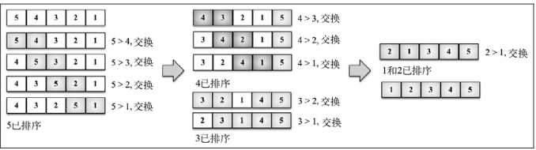

# Basic Knowledge -- Sort

## 1. 排序的基本概念与分类

### 1.1 内排序与外排序

- **内排序**是在排序整个过程中，待排序的所有记录全部被放置在内存中
- **外排序**是由于排序的记录个数太多，不能同时放置在内存，整个排序过程需要在内外存之间多次交换数据才能进行
- 根据排序过程中借助的主要操作，**内排序分为**：插入排序、交换排序、选择排序和归并排序

### 1.2 冒泡排序

- **冒泡排序（Bubble Sort）**是一种交换排序，它的基本思想是：**两两比较相邻记录的关键字，如果反序则交换，直到没有反序的记录为止**，元素向上移动至正确的顺序，就像气泡升至表面一样，因此称为冒泡排序


经典的冒泡排序如上图所示，但是我们可以看到，其实在第一次循环之后，5已经移动到了最后，之后的循环中没有必要对其进行比较，因此，可以进行优化：第一轮循环后，其实最大的一位已经到了最后，再下一次内循环中，可以减少一次；以此类推，内循环中可以减去外循环的次数



<u>代码如下</u>：

```js
function modifiedBubbleSort(array) {
    const length = array.length;
    for (let i = 0; i < length; i++) {
        for (let j = 0; j < length -1 - i; j++) {
            if (array[j] > array[j+1]) {
                swap(array, j, j + 1); //swap参照文末方法
            }
        }
    }
}
```

> 冒泡排序复杂度分析
> 最好为：$O(n)$，最坏为：$O(n^2)$
- 最好的情况，就是排序的表本身就是有序的，因此只需要第一轮判断即可(n-1)次，即时间复杂度为 $O(n)$
- 最坏的情况，完全是逆序，那么就需要循环完全，第一次(n-1)，第二次(n-2)，第三次(n-3)···一直到1，如下式所示，因此总的时间复杂度为 $O(n^2)$
$1+2+3+···+(n-2)+(n-1) = \frac{n*(n-1)}{2}$

### 1.3 简单选择排序
- **简单选择排序法（Simple Selection Sort）**就是通过 `n-i` 次关键字间的比较，从 `n-i+1` 个记录中选出关键字最小的记录，并和第 `i(1<=i<=n)` 个记录交换。即第i次找到第i小的值，并放在第i位

```js
function selectionSort(array) {
    const length = array.length;
    let indexMin; // 标记最小值的位置
    for (let i = 0; i < length; i++) {
        indexMin = i;
        for (let j = i + 1; j < length; j++) {
            if (array[j] < array[indexMin]>) { // 比较indexMin位置的值和j位置的值的大小
                indexMin = j;
            }
        }
        // 如果i位置的值不再是indexMin位置的值，则交换二者，注意这里虽然比较了多次，但是只交换一次
        if ( i !== indexMin) {
            swap(array, i, indexMin); 
        }
    }
}
```

> 简单选择排序复杂度分析
> $O(n^2)$
- 不管情况如何，都需要进行(n-i) 次比较，第一次(n-1)，第二次(n-2)，第三次(n-3)···一直到1，如下式所示，因此总的时间复杂度为 $O(n^2)$ 。但是要注意，虽然与冒泡排序复杂相同，但是简单选择排序由于交换次数少，性能还是要好于冒泡排序的
$1+2+3+···+(n-2)+(n-1) = \frac{n*(n-1)}{2}$


-----

> 用到的方法
```js
// swap: array中交换两个元素
// 经典方法
function swap(array, a, b) {
    const temp = array[a];
    array[a] = array[b];
    array[b] = temo;
}
// ES2015方法
function swap(array, a, b) {
    [array[a], array[b]] = [array[b], array[a]];
}
```

