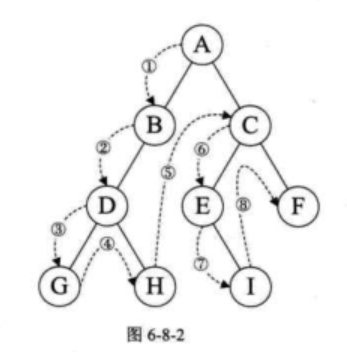
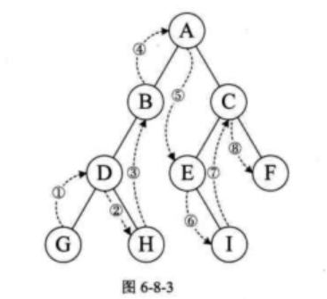
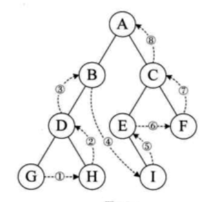
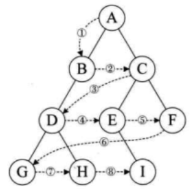

## 二叉树的遍历

### 1. 前序遍历
若二叉树为空，则空操作返回，否则先访问根节点，然后前序遍历左子树，再前序遍历右子树


```js
// 前序遍历算法
function PreOrderTraverse(root) {
    if (root == null) {
        return;
    }

    console.log(root.val); // 输出根结点数据
    PreOrderTraverse(root.left); // 先遍历左子树
    PreOrderTraverse(root.right); // 再遍历右子树
}
```

### 2. 中序遍历
若树为空，则空操作返回，否则从根节点开始（注意并不是先访问根节点），中序遍历根节点的左子树，然后是访问根节点，最后中序遍历右子树


```js
// 中序遍历算法
function PreOrderTraverse(root) {
    if (root == null) {
        return;
    }

    PreOrderTraverse(root.left); // 先遍历左子树
    console.log(root.val); // 输出根结点数据
    PreOrderTraverse(root.right); // 再遍历右子树
}
```

### 3. 后序遍历
若树为空，则空操作返回，否则从左到右先叶子后结点的方式遍历访问左右子树，最后是访问根结点


```js
// 后序遍历算法
function PreOrderTraverse(root) {
    if (root == null) {
        return;
    }

    PreOrderTraverse(root.left); // 先遍历左子树
    PreOrderTraverse(root.right); // 再遍历右子树
    console.log(root.val); // 输出根结点数据
}
```

### 4. 层序遍历
若数为空，则空操作返回，否则从树的第一层，也就是根结点开始访问，从上而下逐层遍历，在同一层中，按从左到右的顺序对结点逐个访问
