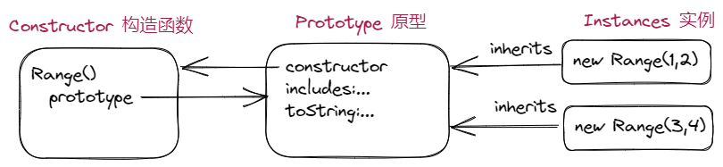

## **第3章 类型、值和变量**

### **3.1 概述与定义**

- JavaScript类型可以分为两类：**原始类型**和**对象类型**
- 常量使用 `const` 声明, 变量使用 `let` 声明, *var* 已经不使用了

### **3.2 数值**

### **3.2.3 JavaScript中的算术**

```
 Math.pow(2,53) // => 2的53次方
 Math.round(.6) // => 1.0: 四舍五入到最接近的整数
 Math.ceil(.6) // => 1.0: 向上取最接近的整数
 Math.floor(.6) // => 0.0: 向下舍入到最接近的整数
 Math.abs(-5) // => 5: 绝对值
 Math.max(x,y,z) // 返回最大数
 Math.min(x,y,z) // 返回最小数
```

### **3.2.5 通过BigInt表示任意精度整数**

- BigInt 字面量写作一串数字后跟小写字母`n`, 如: `1000n`, `1234n`

### **3.3 文本**

### **3.3.3 使用字符串**

- JavaScript 中的字符串是**不可修改**的, 如 `replace()` 和 `toUpperCase()` 这样的方法都返回新字符串

### **3.4 布尔值**

- 六个假性值: `undefined`, `null`, `0` , `0`, `NaN`, `""`, 这些值都相当于 `false`

### 3.8 不可修改的原始值与可修改的对象引用

- 对象不是按值比较的，两个不同的对象即使拥有完全相同的属性和值，也不想等。两个不同的数组，即使每个元素都相同，顺序也相同，它们也不相等
- 把对象（或数组）赋值给一个变量，其实是在赋值引用，并不会创建对象的新副本

```jsx
let a = [1, 2, 3];
let b = [1, 2, 3];
console.log(a === b); // => false, a 和 b是两个不同的数组
console.log(a == b); // => false, == 判断依然是不同数组

let c = a;
c.push(4);
console.log(a); // => [1,2,3,4]，在修改c的时候，a也发生了改变，因为c复制的是a的一个引用
console.log(c); // => [1,2,3,4]

let d = [1];
let e = 1;
console.log(d == e); // => true, == 会进行宽松相等测试，会将数组转换为原始值
```

### 3.9 类型转换

#### 3.9.2 显式转换

- `parseInt()` 和 `parseFloat()` 都会跳过开头的空格，尽量多地解析数字字符

### 3.10 变量声明与赋值

#### 3.10.1 使用`let`和`const`声明

- 变量通过`let`关键字声明，如果在`let`语句中不为变量指定初始值，变量也会被声明，并被赋值为`undefined`
- `const`必须在声明时初始化常量
- `let`和`const`声明的变量具有块作用域
- 如果声明位于顶级，在任何代码块的外部，则称其为全局变量或全局常量，具有全局作用域

#### 3.10.2 使用`var`的变量声明

- var最不寻常的一个特性是作用域提升(hoisting)，使用`var`声明的变量，声明会被提升到函数顶部，但初始化仍然在代码所在处，即函数内可以在初始化变量前使用这个变量而不报错(undefined)，这也是`let`要纠正的一个重要错误

```jsx
const func = () => {
	console.log(i); // => undefined, 不会报错
	var i = 1;
}
```

## 第4章 表达式与操作符

### 4.4 属性访问表达式

- JavaScript定义了两种访问属性的语法：

  - expression.identifier
  - expression[expression]

  ```jsx
  let j = {'a': 1, 'b': 2}
  console.log(j.a); // => 1
  console.log(j['a']); // => 1
  ```

## 第5章 语句

### 5.4 循环语句

#### 5.4.4 for/of

- ```
  for/of
  ```

   循环专门用于可迭代对象（数组，字符串，集合和映射），而对象是不可迭代的，因此可以使用

  ```
  for/in
  ```

  方法或

  ```
  基于Object.keys()
  ```

  对对象的属性进行迭代：

  - Object.keys()对对象属性名进行迭代

    ```jsx
    let m = {'a': 1, 'b': 2, 'c': 3};
    for (let item in Object.keys(m)) {
    	console.log(item); // => a, b, c
    }
    ```

  - Object.values()对对象值进行迭代

    ```jsx
    let m = {'a': 1, 'b': 2, 'c': 3};
    for (let item in Object.values(m)) {
    	console.log(item); // => 1, 2, 3
    }
    ```

  - Object.entries()对对象的键值数组进行迭代，注意使用时要**配合解构赋值**

    ```jsx
    let m = {'a': 1, 'b': 2, 'c': 3};
    for (let [key, value] in Object.entries(m)) {
    console.log(key); // => a, b, c	
    console.log(value); // => 1, 2, 3
    }
    ```

### 5.7 声明

#### 5.7.2 function

- 无论在作用域什么地方声明函数，这些函数都会被“提升“，因此在程序中，调用函数的代码可能位于声明函数的代码之前，但类`class`不行。


## 第6章 对象

### 6.1 对象简介

- 对象是一个属性的无序集合

  > An object is an unordered collection of *properties*

- JavaScript对象也可以从其他对象继承属性, 这个其他对象称为其"原型"

  > A JavaScript object also inherits the properties of another object, known as its "prototype"

### 6.2 创建对象

- 创建对象的三种方式:

  1. 通过对象字面量(Object Literals)
  2. `new`关键字
  3. `Object.create()`

  ```javascript
  let point = {x: 0, y: 1}; // 通过对象字面量
  let a = new Array(); // 使用new创建对象
  let o = Object.create({x: 1, y: 2}); // 使用Object.create()创建对象
  ```

#### 6.2.4 Object.create()

- `Object.create()`用于创建一个新对象, 使用其第一个参数作为新对象的原型

- `Object.create()`的一个用途是防止对象被某个第三方函数库意外(但非恶意)修改

  > One use for `Object.create()` is when you want to guard against unintended (but nonmalicious) modification of an object by a library function that you don't have control over.

### 6.5 测试属性

- 可以使用`in`操作符, `hasOwnProperty()`, `propertyIsEnumerable()`或直接查询相应属性来测试是否有属性. `in`和`hasOwnProperty()`区别在于, `in`操作符可以测试继承的属性, 但`hasOwnProperty()`只能测试自有属性

  > The `hasOwnProperty()` method of an object tests whether that object has an **own** property with the given name.

  ```javascript
  const obj1 = { x: 1, y: 2 };
  console.log(("x" in obj1)); // => true
  console.log(("toString" in obj1)); // => true
  console.log((obj1.hasOwnProperty("x"))); // => true
  console.log((obj1.hasOwnProperty("toString"))); // => false, toString不是obj1的自由属性
  ```

### 6.6 枚举属性

- `for/in`可以枚举对象继承的属性, 但是对象继承的内置方法是不可枚举的

  ```javascript
  const obj1 = { x: 1, y: 2 };
  let obj2 = Object.create(obj1);
  obj2["z"] = 3;
  
  for (let p in obj2) {
    console.log(p); // => z, x, y
  }
  ```


## 第7章 数组

### 7.2 读写数组元素

- 数组是一种特殊的对象. JavaScript会将数组索引转换为字符串, 即索引`1`会变成字符串`"1"`

  ```javascript
  let nums = [1, 2, 3];
  console.log((nums[1] === nums["1"])); // => true
  ```

- 所有索引都是属性名, 但只有介于`0~2^32-2`之间的整数属性名才是索引

- 可以使用负数或非整数值来索引数组, 但此时更像是添加了一个键值对

  ```javascript
  let nums = [1, 2, 3];
  nums[-1.23] = true;
  console.log(nums); // => [ 1, 2, 3, '-1.23': true ]
  ```

- 还有如下属性

  ```javascript
  let nums = [1, 2, 3];
  nums["10"] = 10;
  console.log(nums); // => [ 1, 2, 3, <7 empty items>, 10 ]
  console.log(nums[1.00]); => 2
  ```


## **第8章 函数**

### 8**.1 定义函数**

#### 8.1.1 函数声明

- 函数声明语句会被“提升”到包含脚本、函数或代码块的顶部，因此调用以这种方式定义的函数时，调用代码可以出现在函数定义代码之前

#### 8.1.2 函数表达式

- 函数声明 VS 函数表达式

  在使用声明形式时，先创建好函数对象，然后再运行包含它们的代码，而且函数的定义会被提升到顶部，因此在定义函数的语句之前就可以调用它们

  但对于表达式函数，在定义它们的表达式实际被求值以前是不存在的，不能被调用

  箭头函数也同样不能被调用

  ```jsx
  n(); // 可以调用方法n
  function n() {
  	// ...function
  }
  
  o(); // 报错！
  const o = function () {
  	// ...function
  }
  
  p(); //报错！
  const p = () => {
  	// ...function
  }
  ```

#### 8.1.3 箭头函数

- 箭头函数有一个极其重要的区别：它们从定义自己的环境继承`this`关键字的值，而不是像以其他方式定义的函数那样定义自己的调用上下文
- 箭头函数与其他函数还有一个区别，就是它们没有`prototype`属性

### 8.2 函数调用

#### 8.2.3 构造函数调用

- 如果函数或方法调用前面加了一个关键字 **`new`** , 那它就是构造函数调用. 构造函数会创建一个新的空对象, 这个对象继承构造函数的`prototype`属性指定的对象

### 8.4 函数作为值

- 把函数赋值给另一个变量同样可以调用

  ```javascript
  let q = function() {
      console.log('this is function q');
  };
  let r = q;
  r(); // => 'This is function q"
  ```

- 也可以把函数赋值给对象的属性, 这时把函数称作"方法"

### 8.6 闭包

- JavaScript 使用**词法作用域(lexical scoping)**. 这意味着函数执行时使用的是定义函数时生效的变量作用域, 而不是调用函数时生效的变量作用域. 这种函数对象与作用域组合起来解析函数变量的机制, 称作**闭包(closure)**

  ```javascript
  let s = "global scope"; // 定义全局变量
  function t () {
      let s = 'local scope'; // 定义局部变量
      function u () { // 使用箭头函数也可以
          return s;
      }
      return u();
  }
  
  console.log(t()); // => 'local scope'
  // 这正是闭包的本质: 它们会捕获自身定义所在外部的局部变量(及参数)绑定
  ```

### 8.7 函数属性, 方法与构造函数

#### 8.7.5 bind() 方法

- `bind()`方法的主要目的是把函数绑定到对象

- `bind()`也可以执行"部分应用",即在第一个参数之后传给`bind()`的参数也会随着`this`值一起被绑定, 部分应用时函数式编程中的一个常用技术, 有时候也称为柯里化(currying)

  > The `bind()` method does more than just bind a function to an object, however. It can also perform partial application: any arguments you pass to `bind()` after the first are bound with the `this` value. This partial application feature of `bind()` does work with arrow functions. Partial application is a common technique in functional programming and is sometimes called *currying*

```javascript
function v_func (numb) {
    return this.numa + numb;
}

// 不使用柯里化
let w_obj = {numa: 1}; // 要绑定的对象
let x_func = v_func.bind(w_obj);
console.log(x_func(2)); // => 3

// 使用柯里化
let w_obj = {numa: 1}; // 要绑定的对象
let x_func = v_func.bind(w_obj, 2);
console.log(x_func()); // => 3
```

在上述代码中, `v_func`返回值指定了`this.numa`, 表明`v_func`必须有能够继承的`this`值, 如果我们单独调用`v_func`, 则`numa`始终不会被赋值, 因此, `v_func`绑定的对象, 必须具有`numa`这个属性

```javascript
function v_func (numb) {
    return this.numa + numb;
}
console.log(v_func(numb:2, 3)) // 从webStorm中可以清楚看到,无论调用v_func时有多少赋值, 都只能被赋给numb
```

如果我们将`v_func`改写为下面这样, 则可以更清楚的看到*currying*

```javascript
function v_func (numa, numb) {
    return numa + numb;
}

let w_obj = {numa: 1}; // 要绑定的对象
let x_func = v_func.bind(w_obj, 2, 3);
console.log(x_func(6)); // => 5, 因为上面的代码,已经将 2和3 部分应用到了numa和numb, 后面再有的都属于多的实参
console.log(w_obj.numa); // => 1, 此时numa只是w_obj的一个属性了
```

同时也要注意, 如果`v_func`是箭头函数, 那么将不能绑定`this`. 因为箭头函数从定义它们的环境中继承`this`值, 且这个值不能被`bind()`覆盖

```javascript
const v_func = (numb) => {
    return this.numa + numb;
}

let w_obj = {numa: 1}; // 要绑定的对象
let x_func = v_func.bind(w_obj);
console.log(x_func(2)); // => NaN
```

### 8.8 函数式编程

#### 8.8.2 高阶函数

- 高阶函数就是操作函数的函数, 它接收一个或多个函数作为参数并返回一个新函数

  > A *higher-order function* is a function that operates on functions, taking one or more functions as arguments and returning a new function.


## 第9章 类

### 9.2 类和构造函数

- 构造函数是一种专门用于初始化新对象的函数

#### 9.2.2 constructor属性

- 每个普通的JavaScript函数自动拥有一个`prototype`属性, 这个属性的值是一个对象, 有一个不可枚举的`constructor`属性. 而这个`constructor`属性的值就是该函数对象: `F.prototype.constructor === F`

  

### 9.5 子类

#### 9.5.2 通过`extends`和`super`创建子类

- 如果使用`extends`关键字定义了一个类,那么这个类的构造函数必须使用`super()`调用父类构造函数
- 在通过`super()`调用父类构造函数之前, 不能在构造函数中使用`this`关键字. 因为要确保父类先于子类得到初始化


## 第11章 JavaScript标准库

### 11.1 集合与映射

#### 11.1.1 Set类

- 集合就是一组值, 与数组类似. 但与数组不同的是, 集合没有索引或顺序, 也不允许重复

  ```javascript
  let ad = new Set();
  ad.add(1);
  console.log(ad); // => Set(1) { 1 }
  ad.add([2, 3]);
  console.log(ad); // => Set(2) { 1, [ 2, 3 ] }
  ad.add([2, 3]);
  console.log(ad); // => Set(3) { 1, [ 2, 3 ], [ 2, 3 ] }
  
  // 两次添加的 [2, 3] 并不是相同的引用, 因此会添加两个
  ```

#### 11.1.2 Map类

- `Map`对象表示一组被称为键的值, 其中每个键都关联着(或映射到)另一个值. `Map`初始化时, 需要把关联的键和值写成数组的数组的形式

  ```javascript
  let ae = new Map([["one", 1], ["two", 2]]);
  console.log(ae); // => Map(2) { 'one' => 1, 'two' => 2 }
  ```

- 与集合一样, 任何JavaScript值都可以在映射中作为键或值. 这包括`null`, `undefined`和`NaN`

### 11.3 正则表达式与模式匹配

#### 11.3.2 模式匹配的字符串方法

- String 支持如下使用正则表达式的方法

  - `search()` 搜索

    ```javascript
    let af = "JavaScript".search(/ava/ui);
    console.log(af); // => 1
    let ag = "JavaScript".search(/aa/ui);
    console.log(ag); // => -1
    ```

  - `replace()` 替换

    ```javascript
    let ah = "javascript".replace(/javascript/ui, "JavaScript");
    console.log(ah); // => JavaScript
    let ai = "java'script'".replace(/'([^']*)'/ui, "<$1>");
    console.log(ai); // => java<script>
    ```

  - `match()` 匹配

  - `matchAll()` 全局匹配, 用于遍历所有匹配项

  - `split()` 拆分
