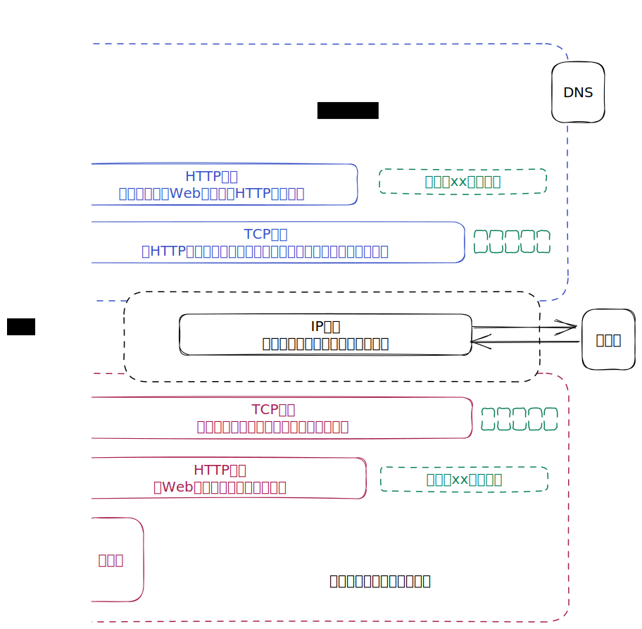

# 图解HTTP

## 第1章 了解Web及网络基础

### 1.3 网络基础TCP/IP

- TCP/IP协议族按层次分为：应用层、传输层、网络层和数据链路层

  | 层次   | 作用                                                 | 协议                                                         |
  | ------ | ---------------------------------------------------- | ------------------------------------------------------------ |
  | 应用层 | 决定了向用户提供应用服务时通信的活动                 | FTP（File Transfer Protocol）文件传输协议、DNS（Domain Name System）域名系统、HTTP |
  | 传输层 | 为应用层提供处于网络连接中的两台计算机之间的数据传输 | TCP（Transmission Control Protocol）传输控制协议、UDP（User Data Protocol）用户数据报协议 |
  | 网络层 | 处理在网络上流动的数据包                             |                                                              |
  | 链路层 | 处理连接网络的硬件部分                               |                                                              |

- 把数据信息包装起来的做法称为**封装**（encapsulate）

### 1.4  与HTTP关系密切的协议：IP、TCP和DNS

- **IP**（Internet Protocol）网际协议位于网络层。

  IP协议的作用是把各种数据包传送给对方，需要IP地址和MAC地址（Media Access Control Address）

- IP间的通信依赖MAC地址，可以采用**ARP**协议（Address Resolution Protocol），根据IP地址反查出对应的MAC地址

- 为了准确无误地将数据送达目标处，TCP协议采用**三次握手**（three-way handshaking）策略。握手过程使用了TCP地标志：SYN（synchronize）和ACK（acknowledgement）

  

- DNS协议提供通过域名查找IP地址，或者逆向从IP地址反查域名的服务

  

- 各种协议与HTTP协议的区别

  

### 1.7 URI和URL

- **URI**（Uniform Resource Identifier）统一资源标识符

  **URL**（Uniform Resource Locator）统一资源定位符

- URI 用字符串标识某一互联网资源，而 URL 表示资源在互联网上所处的位置，可见 **URL 是 URI 的子集**

## 第2章 简单的HTTP协议

### 2.3 HTTP是不保存状态的协议

- HTTP 是一种不保存状态，即无状态（stateless）协议。HTTP 协议自身不对请求和响应之间的通信状态进行保存

### 2.5 告知服务器意图的HTTP方法

- **GET** ：获取资源

  GET 方法用来请求访问 URI 识别的资源。指定的资源经服务器端解析后返回响应内容

- **POST** ：传输实体主体

- **PUT** ：传输文件

  PUT 方法用来传输文件，类似于 FTP 协议的文件上传一样，要求在请求报文的主体中包含文件内容，然后保存到请求 URI 指定的位置

  但是，HTTP/1.1 的 PUT 方法自身不带验证机制，存在安全性问题，如果要使用，必须配合Web应用程序的验证机制，或架构设计采用 REST（REpresentational State Transfer，表征状态转移）标准

- **HEAD** ：获得报文首部

  与 GET 方法类似，只是不返回报文主体部分

- **DELETE** ：删除文件

  与 PUT 相反，同样没有验证机制

- **OPTIONS** ：询问支持的方法
