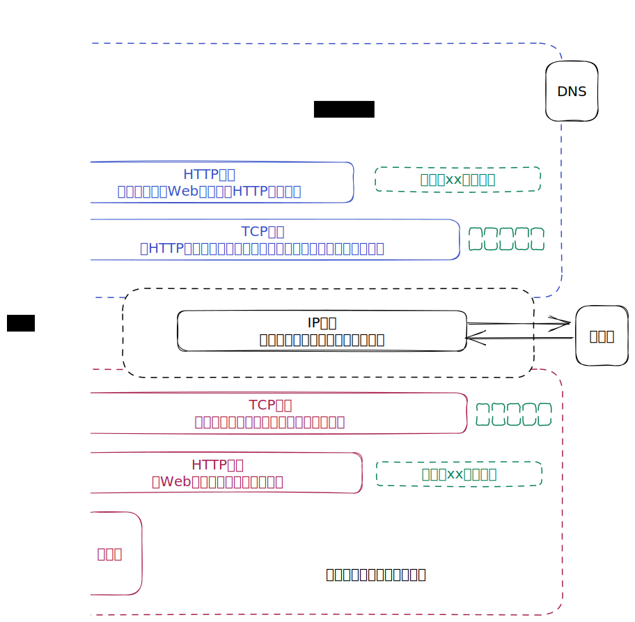
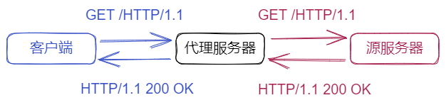
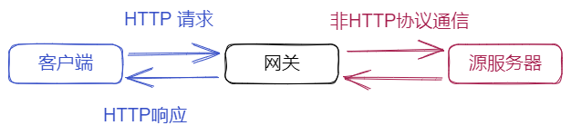

# 图解HTTP

## 第1章 了解Web及网络基础

### 1.3 网络基础TCP/IP

- TCP/IP协议族按层次分为：应用层、传输层、网络层和数据链路层

  | 层次   | 作用                                                 | 协议                                                         |
  | ------ | ---------------------------------------------------- | ------------------------------------------------------------ |
  | 应用层 | 决定了向用户提供应用服务时通信的活动                 | FTP（File Transfer Protocol）文件传输协议、DNS（Domain Name System）域名系统、HTTP |
  | 传输层 | 为应用层提供处于网络连接中的两台计算机之间的数据传输 | TCP（Transmission Control Protocol）传输控制协议、UDP（User Data Protocol）用户数据报协议 |
  | 网络层 | 处理在网络上流动的数据包                             |                                                              |
  | 链路层 | 处理连接网络的硬件部分                               |                                                              |

- 把数据信息包装起来的做法称为**封装**（encapsulate）

### 1.4  与HTTP关系密切的协议：IP、TCP和DNS

- **IP**（Internet Protocol）网际协议位于网络层。

  IP协议的作用是把各种数据包传送给对方，需要IP地址和MAC地址（Media Access Control Address）

- IP间的通信依赖MAC地址，可以采用**ARP**协议（Address Resolution Protocol），根据IP地址反查出对应的MAC地址

- 为了准确无误地将数据送达目标处，TCP协议采用**三次握手**（three-way handshaking）策略。握手过程使用了TCP地标志：SYN（synchronize）和ACK（acknowledgement）

  

- DNS协议提供通过域名查找IP地址，或者逆向从IP地址反查域名的服务

  

- 各种协议与HTTP协议的区别

  

### 1.7 URI和URL

- **URI**（Uniform Resource Identifier）统一资源标识符

  **URL**（Uniform Resource Locator）统一资源定位符

- URI 用字符串标识某一互联网资源，而 URL 表示资源在互联网上所处的位置，可见 **URL 是 URI 的子集**

## 第2章 简单的HTTP协议

### 2.3 HTTP是不保存状态的协议

- HTTP 是一种不保存状态，即无状态（stateless）协议。HTTP 协议自身不对请求和响应之间的通信状态进行保存

### 2.5 告知服务器意图的HTTP方法

- **GET** ：获取资源

  GET 方法用来请求访问 URI 识别的资源。指定的资源经服务器端解析后返回响应内容

- **POST** ：传输实体主体

- **PUT** ：传输文件

  PUT 方法用来传输文件，类似于 FTP 协议的文件上传一样，要求在请求报文的主体中包含文件内容，然后保存到请求 URI 指定的位置

  但是，HTTP/1.1 的 PUT 方法自身不带验证机制，存在安全性问题，如果要使用，必须配合Web应用程序的验证机制，或架构设计采用 REST（REpresentational State Transfer，表征状态转移）标准

- **HEAD** ：获得报文首部

  与 GET 方法类似，只是不返回报文主体部分

- **DELETE** ：删除文件

  与 PUT 相反，同样没有验证机制

- **OPTIONS** ：询问支持的方法

- ~~**TRACE** ：追踪路径~~

- **CONNECT** ：要求用隧道协议连接代理

  CONNECT 方法要求在与代理服务器通信时建立隧道，实现用隧道协议进行 TCP 通信。主要使用 SSL（Secure Sockets Layer，安全套接层）和 TLS（Transport Layer Security）协议

> GET 和 POST 的区别
>
> |                           | GET                                                          | POST                                                         |
> | ------------------------- | ------------------------------------------------------------ | ------------------------------------------------------------ |
> | **参数（Parameters）**    | 在URL中携带参数                                              | 参数包含在请求体（request body）                             |
> | **数据量（Data Size）**   | GET 发送 URL 时携带的参数大小有限制（根据HTTP/1.1规范，不应该超过2048字节） | POST 可以在请求体中包含更多参数                              |
> | **缓存（Caching）**       | GET 请求可以被浏览器缓存                                     | POST 请求不可以被缓存                                        |
> | **安全性（Security）**    | GET 请求携带的参数可以在 URL 中看到，并可以被截获            | POST 请求会在请求体中加密参数                                |
> | **幂等性（Idempotence）** | GET 请求是幂等的，对同一个 URL 执行多次 GET 请求，不会改变服务器的状态，如多次请求某篇文章的信息 | POST 请求不是幂等的，每次 PSOT 请求都会创建或更新资源，如在论坛添加帖子 |
>
> *注*：幂等性（Idempotence）：指执行相同操作多次不会对系统状态造成影响，即结果和执行一次相同

### 2.8 使用Cookie的状态管理

- HTTP 是无状态协议。Cookie 技术通过在请求和响应报文中写入 Cookie 信息来控制客户端的状态

  Cookie 会根据从服务端发送的响应报文内的一个叫做 Set-Cookie 的首部字段信息，通知客户端保存Cookie，当下次客户端再往该服务器发送请求时，客户端会自动在请求报文中加入Cookie值后发送

## 第3章 HTTP报文内的HTTP信息

### 3.1 HTTP报文

- HTTP报文大致可分为报文首部和报文主体两块。两者由最初出现的空行（CR+LF）来划分，可以没有报文主体

- 请求报文和响应报文结构

  

### 3.3 编码提升传输速率

- 报文和实体的区别

  - **报文（message）**：是HTTP通信中的基本单位，由8位字节流（octet sequence）组成，通过HTTP通信传输
  - **实体（entity）**：作为请求或响应的有效载荷数据（补充项）被传输，内容由实体首部和实体主体组成

  HTTP 报文的主体用于传输请求或响应的实体主体

- **内容协商机制**是指客户端和服务器端就响应的资源内容进行交涉，然后提供给客户端最为适合的资源

## 第4章 返回结果的HTTP状态

### 4.1 状态码告知从服务器端返回的请求结果

- 状态码的职责是当客户端向服务端发送请求时，描述返回的请求结果。借助状态码，用户可以知道服务端是正常处理了请求，还是出现了错误

- **状态码的类别**

  |      | 类别                             | 原因短语                   |
  | ---- | -------------------------------- | -------------------------- |
  | 1XX  | Informational（信息性状态码）    | 接收的请求正在处理         |
  | 2XX  | Success（成功状态码）            | 请求正常处理完毕           |
  | 3XX  | Redirection（重定向状态码）      | 需要进行附加操作以完成请求 |
  | 4XX  | Client Error（客户端错误状态码） | 服务器无法处理请求         |
  | 5XX  | Server Error（服务端错误状态码） | 服务器处理请求出错         |

### 4.2 `2XX`成功

| 状态码 | 内容            | 含义                                                         |
| ------ | --------------- | ------------------------------------------------------------ |
| 200    | OK              | 从客户端发来的请求在服务端被正常处理了                       |
| 204    | No Content      | 服务器接收的请求已成功处理，但在返回的响应报文中不含实体主体部分 |
| 206    | Partial Content | 表示客户端进行了范围请求，而服务器成功执行了这部分的GET请求  |

### 4.3 `3XX`重定向

| 状态码 | 内容               | 含义                                                         |
| ------ | ------------------ | ------------------------------------------------------------ |
| 301    | Moved Permanently  | 永久性重定向。表示请求的资源已被分配了新的URI，以后应使用资源现在所指的URI |
| 302    | Found              | 临时性重定向。表示请求的资源已被分配了新的URI，希望用户本次能使用新的URI访问 |
| 303    | See Other          | 表示由于请求对应的资源存在着另一个URI，应使用GET方法定向获取请求的资源 |
| 304    | Not Modified       | 表示客户端发送附带条件的请求时，服务端允许请求方位资源，但未满足条件的情况，与重定向无关 |
| 307    | Temporary Redirect | 临时重定向。与302 Found含义相同，307会遵照标准，不会从POST变成GEt |

​	*注*：当 301、302、303 状态码返回时，几乎所有的浏览器都会把POST改成GET，并删除请求报文内的主体，之后请求会自动再次发送

### 4.4 `4XX`客户端错误

| 状态码 | 内容         | 含义                                                         |
| ------ | ------------ | ------------------------------------------------------------ |
| 400    | Bad Request  | 表示请求报文中存在语法错误。当错误发生时，需修改请求的内容后再次发送请求 |
| 401    | Unauthorized | 临时性重定向。表示请求的资源已被分配了新的URI，希望用户本次能使用新的URI访问 |
| 403    | Forbidden    | 表示对请求资源的访问被服务器拒绝了                           |
| 404    | Not Found    | 表示服务器上无法找到请求的资源                               |

### 4.5 `5XX`服务端错误

| 状态码 | 内容                  | 含义                                                     |
| ------ | --------------------- | -------------------------------------------------------- |
| 500    | Internal Server Error | 表示服务端在执行请求时发生了错误                         |
| 503    | Service Unavaliable   | 表示服务端暂时处于超负载或正在进行停机维护，无法处理请求 |

## 第5章 与HTTP协作的Web服务器

### 5.2 通信数据转发程序：代理、网关、隧道

- **代理**是一种有转发功能的应用程序，它扮演了位于服务端和客户端“中间人”的角色，接收由客户端发送的请求并转发给服务器，同时也接收服务器返回的响应并转发给客户端

  

- **网关**是转发其他服务器通信数据的服务器，接收从客户端发送来的请求时，它就像自己拥有资源的源服务器一样对请求进行处理

  

- **隧道**是在相隔甚远的客户端和服务器两者之间进行中转，并保持双方通信连接的应用程序

  

## 第6章 HTTP首部

### 6.1 HTTP报文首部

- HTTP 请求报文首部

  

- HTTP 响应报文首部

  

## 第7章 确保Web安全的HTTPS

### 7.1 HTTP的缺点

- 通过和 SSL（Secure Socket Layer，安全套阶层）或 TLS（Transport Layer Security，安全层传输协议）的组合使用，可以加密 HTTP 的通信内容。**与 SSL 组合使用的 HTTP 称为 HTTPS** （HTTP Secure，超文本传输安全协议）

- 虽然使用 HTTP 协议无法确定通信方，但如果使用 SSL 则可以。SSL 不仅提供加密处理，还使用了一种被称为**证书**的手段

- 由于 HTTP 协议无法证明通信的报文完整性，因此，即使请求或响应的内容遭到篡改，也没有办法获悉

  请求或响应在传输途中，遭攻击者拦截并篡改内容的攻击称为中间人攻击（Man-in-the-middle attack, MITM）

### 7.2 HTTP+加密+认证+完整性保护 = HTTPS

- **HTTP加上加密处理和认证以及完整性保护后便是HTTPS**

- 通常，HTTP直接和TCP通信，当使用SSL时，则演变为先和SSL通信，再由SSL和TCP通信了

  

- 加密和解密用同一个密钥的方式称为**共享密钥加密（Common key crypto system）**，也被叫做对称密钥加密
- **公开密钥加密**使用一对非对称的密钥。一把叫做私有密钥（private key），一把叫做公开密钥（public key）。使用公开密钥加密方式，发送密文的一方使用**对方公开密钥**进行加密处理，对方收到被加密信息后，再使用自己的私有密钥进行解密

## 第9章 基于HTTP的功能追加协议

### 9.2 消除HTTP瓶颈的SPDY

- **Ajax**（Asynchronous JavaScript and XML，异步JavaScript与XML技术）是一种有效利用JavaScript和DOM（Document Object Model，文档对象模型）的操作，以达到局部Web页面替换加载的异步通信手段

### 9.3 使用浏览器进行全双工通信的WebSocket

- WebSocket，即Web浏览器与Web服务器之间全双工通信标准。

## 第11章 Web的攻击技术

### 11.2 因输出值转义不完全引发的安全漏洞

- **跨站脚本攻击**（Cross-Site Scripting, XSS）是指通过存在安全漏洞的Web网站注册用户的浏览器内运行非法的HTML标签或JavaScript进行的一种攻击
- **SQL注入**（SQL Injection）是指针对Web应用使用的数据库，通过运行非法的SQL而产生的攻击
- **OS命令注入攻击**（OS Command injection）是指通过Web应用，执行非法的操作系统命令达到攻击的目的
- **HTTP首部注入攻击**（HTTP Header Injection）是指攻击者通过在响应首部字段内插入换行，添加任意响应首部或主体的一种攻击
- **邮件首部注入**（Mail Header Injection）是指Web应用中的邮件发送功能，攻击者通过向邮件首部To或Subject内添加任意非法内容发起的攻击
- **目录遍历攻击**（Directory Traversal）攻击是指对本无意公开的文件目录，通过非法截断其目录路径后，达成访问目的的一种攻击
- **远程文件包含漏洞**（Remote File Inclusion）是指当部分脚本内容需要从其他文件读入时，攻击者利用指定外部服务器的URL充当依赖文件，让脚本读取之后，就可运行任意脚本的一种攻击

### 11.3 因设置或设计上的缺陷引发的安全漏洞

- **强制浏览**（Forced Browsing）安全漏洞是指，从安置在Web服务器的公开目录下的文件中，浏览那些原本非自愿公开的文件
- **不正确的错误消息处理**（Error Handling Vulnerability）的安全漏洞是指，Web应用的错误信息内包含对攻击者有用的信息
- **开放重定向**（Open Redirect）是一种对指定的任意URL做重定向跳转的功能

#### 11.4 因会话管理疏忽引发的安全漏洞

- **会话劫持**（Session Hijack）是指攻击者通过某种手段拿到了用户的会话ID，并非法使用此会话ID伪装成用户，达到攻击的目的
- **会话固定攻击**（Session Fixation）会强制用户使用攻击者指定的会话ID，属于被动攻击
- **跨站点请求伪造**（Cross-Site Request Forgeries, CSRF）攻击是指攻击者通过设置好的陷阱，强制对已完成认证的用户进行非预期的个人信息或设定信息等某些状态更新，属于被动攻击

### 11.5 其他安全漏洞

- **密码破解攻击**（Password Cracking）即算出密码，突破认证

- **点击劫持**（ClickJackding）是指利用透明的按钮或链接做成陷阱，覆盖在Web页面之上，又称为界面伪装（UI Redressing）

- **Dos攻击**（Denial of Service attack）是一种让运行中的服务呈停止状态的攻击，有时也叫做服务停止攻击或拒绝服务攻击

  多台计算机发起的Dos攻击称为**DDoS**攻击（Distributed Denial of Service attack）

- **后门程序**（Backdoor）是指开发设置的隐藏入口，可不按正常步骤使用受限功能
